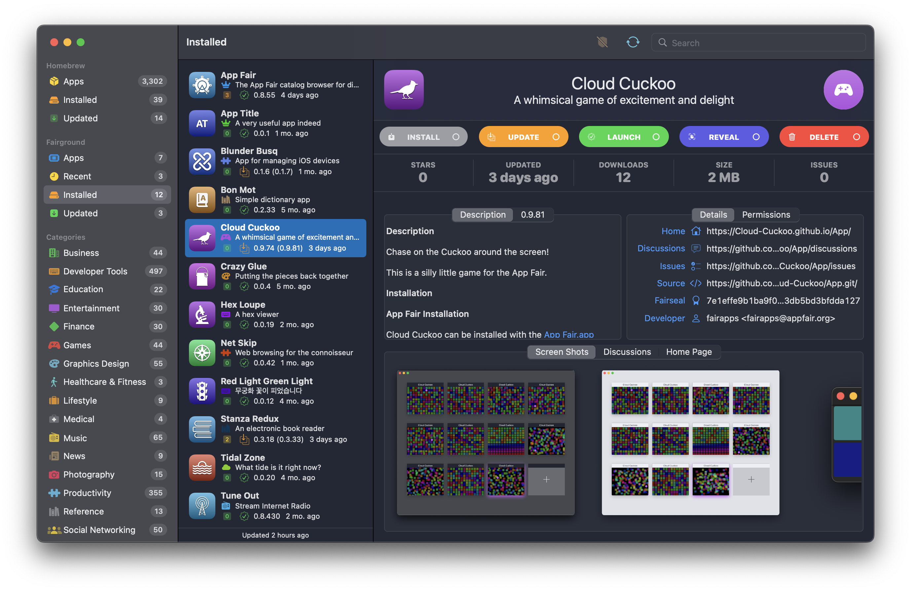
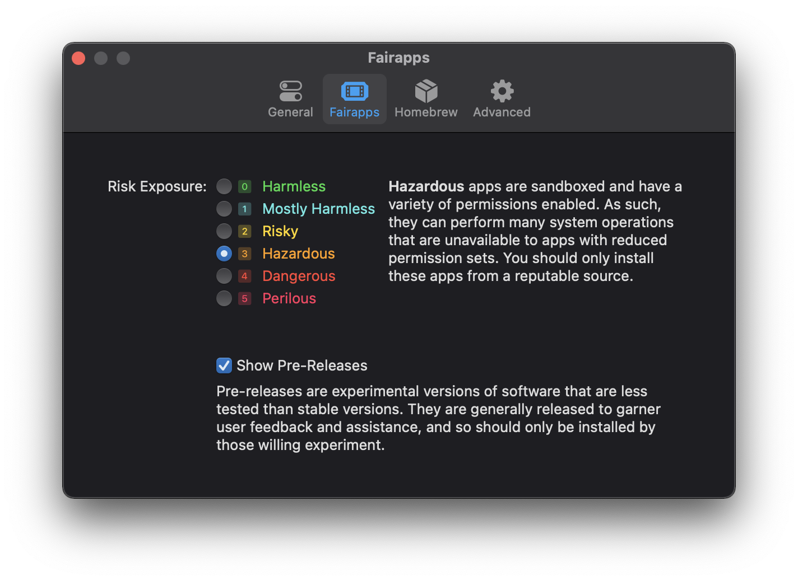
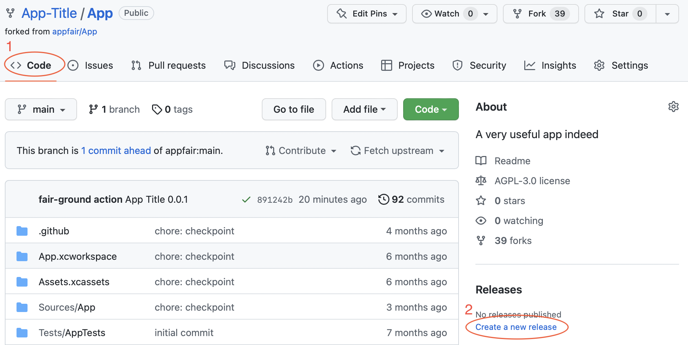
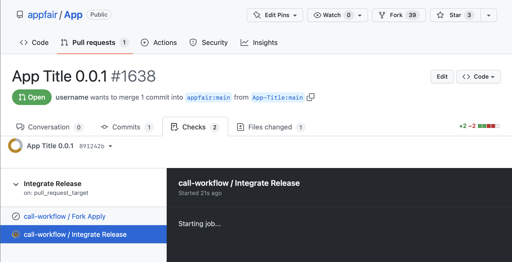
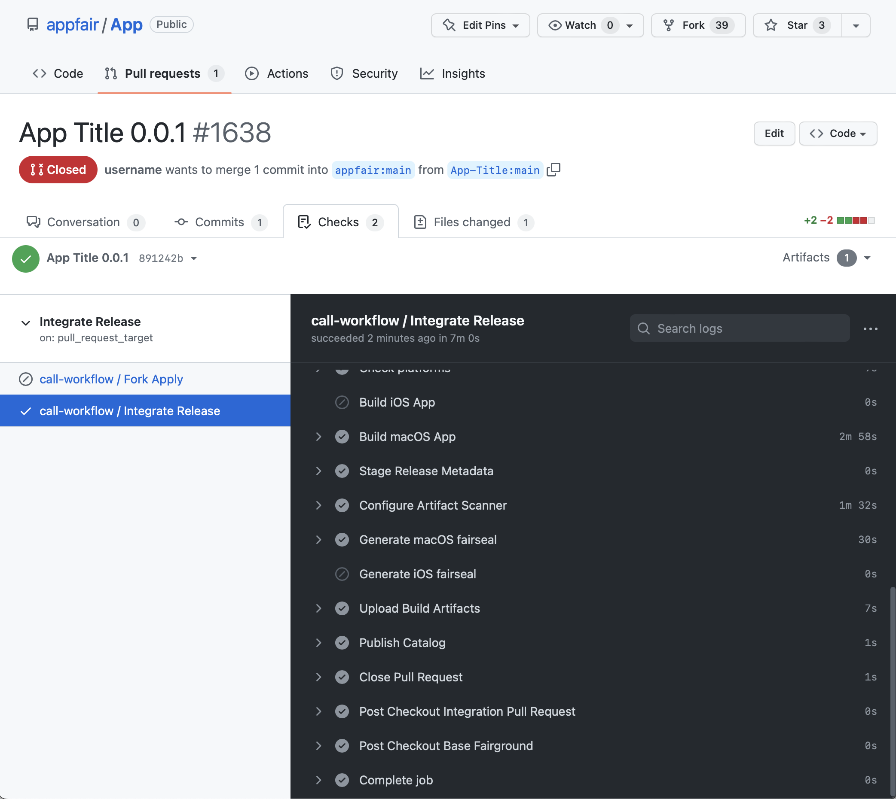

<p align="center">
<a alt="Download the App Fair app for macOS 12" href="https://appfair.app"></a>
<h1 style="text-align: center; font-family: ui-rounded, Arial Rounded MT Bold, Helvetica Rounded, Arial, sans-serif;">Welcome to appfair.net</h1>
</p>

appfair.net is an autonomous distribution network of free and
open-source macOS and iOS applications.
App Fair apps use modern native frameworks and user-interface
elements with a focus on performance, efficiency, and accessibility.

The app catalog can be accessed using `App Fair.app`, which is a native app for macOS 12.5 that can be downloaded from [appfair.app](https://appfair.app).
New users should start by downloading this app and exploring its features and capabilities.
For help and assistance with the App Fair application itself,
visit the [project discussions](https://github.com/App-Fair/App/discussions),
join the [discord channel](https://discord.gg/R4bFP8qpw7),
and browse the [issue reports](https://github.com/App-Fair/App/issues).

The rest of this document serves as a guide for the development and publication of your own apps on the appfair.net [app source](#appsource) catalog;
It assumes some familiarity with GitHub and software development in the Swift programming language.

## The App Fair for End Users

<a href="assets/app-fair-app.png" target="_blank"></a>

From an end-user perspective, the <a href="https://appfair.app" target="_blank">`App Fair.app`</a> catalog browser is a graphical tool that enables users to search, browse, compare, appraise, install, and update apps from an unlimited online collection of free and open-source applications. 

Apps installed through the <a href="https://appfair.app" target="_blank">`App Fair.app`</a> application are built using the platform-native `SwiftUI` framework and compiled for both Intel and ARM processors, thereby enabling higher performance, lower memory consumption, and more efficient resource utilization than can be achieved with non-native cross-platform application frameworks.

At the same time, they use modern "Sandboxing" techniques to protect your system and ensure that you are always aware of what actions the apps are permitted to take, such as reading and writing files, communicating over the internet, or accessing your camera, microphone, and other connected devices.
And since they rely on the native frameworks of the system, they tend to be quite compact (a few megabytes compressed), and so are quicker to download and launch than a typical web app.

### Getting Started

The App Fair catalog browser app can be installed on macOS 12.5 "Monterey" by downloading [App-Fair-macOS.zip](https://github.com/App-Fair/App/releases/latest/download/App-Fair-macOS.zip).
The app can be dragged from the Downloads folder into the `/Applications` folder, from where it can be launched.


Alternatively, [homebrew](https://brew.sh) users can install the App Fair app with the command:

```
brew install appfair/app/app-fair 
```

And for those who want a headless installation but do not have homebrew,
the app can be downloaded and installed fresh with the command:

```
bash -c "$(curl -fsSL https://appfair.net/install.sh)"
```

Both of these commands will download the latest release zip and install it directly into your `/Applications/` folder.
From there, you can launch the <a href="https://appfair.app" target="_blank">`App Fair.app`</a> catalog browser application to start searching for apps to install.
 
### App Fair Usage



Apps that are installed by <a href="https://appfair.app" target="_blank">`App Fair.app`</a> are placed in `/Applications/App Fair/`.
From there, they can be un-installed using the catalog app itself, or they can be removed using the standard macOS method of dragging the app icon into the trash.

The App Fair catalog browser has preferences for the user's "Risk Exposure", which is a threshold of app permissions that will be presented to the user. Apps distributed through the App Fair are required to enumerate all the sensitive actions that they can perform, such as reading and writing files outside of the app's "sandbox", as well as accessing the internet or using the microphone or camera. 

## The App Fair for App Developers

App Fair apps are written in Swift and utilize a native `SwiftUI` user interface. 
Apps target macOS 12 "Monterey" and Swift version 5.5, giving them access to modern Swift features like async/await.

The distribution process for App Fair apps is instantaneous, automatic, and free.
The only requirement is a GitHub account and a willingness to share your work freely with the rest of the world.
No additional registration, sign-up, or approval is required in order to start developing and distributing apps on the App Fair.

Apps are built, validated, and distributed using GitHub's free actions for open-source projects, and so there is never any cost associated with building and distributing your apps through the App Fair.

App that are distributed through the App Fair can additionally be made available through any other channels available to the platform. For example, App Fair apps are automatically added to a `homebrew` "Cask" of apps, which enables them to be installed without the user needing to first install the App Fair catalog browser app.


<!-- ### Intro Video -->

<!--
<iframe src="https://player.vimeo.com/video/654949321?texttrack=en" frameborder="0" scrolling="no" style="width: 100%; height: 400px; min-height: 150px; border: none; overflow: hidden;" allow="autoplay; fullscreen; picture-in-picture" allowfullscreen></iframe>
-->

## Quick Start

Anyone can create and publish their own app on the App Fair, for free, using only a web browser.
The process just requires a regular GitHub account ([signup here](https://github.com/join)) and under an hour of your time.
At the end of this Quick Start guide, you will have your own app published and available through the <a href="https://appfair.app" target="_blank">`App Fair.app`</a> catalog browser.

  1. The first step is to [create a free GitHub organization](https://github.com/account/organizations/new?plan=team_free). 
  * The name of the organization is the name of your app, so you'll need to choose a new unique name.
  * The name can be easily changed later, so just pick the first available name that comes to mind.
  
  2. Once you have completed the new organization process, [fork the appfair/App repository](https://github.com/appfair/App/fork) into the new organization you just created.
  * The “owner” of the fork must be the new organization, rather than your personal account, since the app's name is defined by the forked repository's owner organization.
  * The forked repository name must be left as "App".
  * The value you enter in the Description text field will be used as the summary title in the App Fair.
  
  3. In your new `/App` repository fork, select the **`Settings`** tab and follow the **`Pages`** settings link on the left.
  * Set the `Source` branch to be `main` and change the root folder to be `/docs`, then hit **Save**.
  * This will set up the landing page for your app that can be used to publish the app description, screenshots, and support information.
  
  4. Select the **`Settings`** tab's **`General`** section and turn on both _`Issues`_ and _`Discussions`_ by activating their checkboxes in the `Features` area.
  * These community features are required for the app to be included in the App Fair catalog.
  * You can optionally enable _`Sponsorships`_ for the project.
  
  5. Select the **`Actions`** tab and then select the “`Configure App`” workflow on the left.
  * Expand the **Run workflow** drop-down, set the version to "_0.0.1_", then hit **Run workflow**.
  * Wait a couple minutes for the action to complete: the yellow dot should turn green, indicating that the workflow ran successfully.
  * Common mis-configurations will be indicated by a red dot; the log for the workflow run will indicate the cause of the issue.
  
  
  6. Select the **`Code`** tab and follow the _`Releases`_ link (on the right side of the page). 
  * Hit the **Create a new Release** button. 
  * Under `Choose a tag`, enter "0.0.1" and hit the "`Create new tag on publish`" menu item. 
  * At the bottom of the page, enable the "`This is a pre-release`" checkbox then hit the **Publish release** button.
  
  
  7. Return to the **`Actions`** tab and wait for the "_Fork Apply_" workflow run to complete. 
  * This process builds your app and releases a binary artifact.
  
  
  8. Select the **`Pull Requests`** tab, then hit the **New Pull Request** button. 
  * On the next page, hit the **Create Pull Request** button. 
  * The `Title` field must be the name and version of the app (e.g., "My App Name 0.0.1"). The body can be left empty. 
  * Hit the **Create Pull Request** button.
  
    
  9. On the new pull request page page, select the _`Checks`_ sub-tab and wait for the "_Integrate Release_" workflow run to complete successfully.
  * This process creates, scans, and validates a reproducible build of your app's binary artifact in a trusted environment.
  * It should take only a few minutes.
  * The pull request will be automatically closed at the end of the run.
  
    
  10. Your app will soon be listed in the [recent apps](https://www.appfair.net/fairapps-macos) catalog, indicating that it has been published successfully.

Congratulations: you now have your very own native app published on the App Fair!  It just has a generic icon, and it doesn't do much of anything (since you haven't written any code yet), but it is yours to develop, maintain, and share with the world.

On a computer with macOS 12 and higher, you can now download and launch the <a href="https://appfair.app" target="_blank">`App Fair.app`</a> catalog browser, enable "Show Pre-Releases" in the app's "Fairapps" preference, search for your app name, and install and run your app. You can also share your app's landing page at `https://<your organization name>.github.io/App` to provide a link for opening your app's entry in the App Fair catalog.

  

The next step will be to code your app, which typically involves cloning your fork to a local machine and opening `App.xcworkspace` in an IDE like `Xcode.app` to run and debug. The `App/Sources/AppContainer.swift` source file contains the scaffold for your SwiftUI code; start there to begin defining your app's behavior. 

The default permissions for App Fair apps are very restrictive (no network or peripheral access, file system access restricted to the app's sandbox folder, etc.), so you can edit the `Sandbox.entitlements` file to expand the permissions for your app. This will affect the "Risk" assessment of the app as shown in the catalog browser, which plays a role in an end user's decision whether to trust and install your app.

You should also update the app's catalog description and categories by updating the repository's description and tags (e.g. "appfair-games" or "appfair-productivity"), and those changes will be automatically integrated into the App Fair catalog entry for your app.

Releasing updates to your app is simply a matter of pushing changes to your fork, updating the app version to "_0.0.2_" using the “`Configure App`” GitHub action, creating a new "_0.0.2_" release tag, and then opening a new Pull Request against [appfair/App](https://github.com/appfair/App/pulls) with your app's name and version as the title. 

And for finishing touches you can fill in your `README.md` with a description of the technical aspects of your app and `docs/index.md` with your landing page's marketing copy. Screenshots saved to the `docs/screenshots/` folder will be automatically published on your landing page, and be displayed in your App Fair catalog entry the next time you publish a new release. You can also register a custom domain (using any domain name registrar) and set that domain in your fork's  Pages setting, making any changes your push from your `docs/` folder immediately available as your app's home page. 

Continue reading for the full development guide, FAQs, and discussion of the security and source disclosure mechanisms for fair-ground apps. Jump right in and start developing your own native app!


## The App Fair fair-ground

The "fair-ground" is the name for the autonomous cataloging service that indexes the releases of forks of the base repository.
It handles organization verification, app build validation, and cataloging of all the verified apps.

The "App Fair" is the reference implementation of the fair-ground system, and is implemented as a set of GitHub repositories, workflows, and policies for cataloging the build artifacts of the app forks.
The configuration for the App Fair is defined primarily in the [appfair/App.git](https://github.com/appfair/App.git) repository, which additionally acts as the base repository to be forked by app developers.

### Introduction: the FAIR process


"Fork-Apply/Integrate-Release" (FAIR) describes the stages of creating, developing, building, and distributing an app.
The "Fork" and "Apply" parts are handled by you, the developer: a fork is created from the base [`/appfair/App.git`](https://github.com/appfair/App.git) repository, and in that fork you develop your app.
Once you enable GitHub actions for your fork, your app will be automatically built and released whenever you push a semantic version tag to your fork's repository.
Since this fork is under the control of the developer, the fork is considered "untrusted", in that the app binary artifact that is built and released has no security or safety guarantees.

In order to be included in the App Fair catalog (and thus be discoverable and installable in the the <a href="https://appfair.app" target="_blank">`App Fair.app`</a> catalog browser app), the fork's release must be independently built and the results be verified as reproducible by the trusted base repository.
This process is initiated by the fork's developer, who signals their desire to validate the release by creating a pull request (PR) from the fork's `/App.git` repository back to the base `/appfair/App.git` repository.

The creation of the PR for the base `/appfair/App.git` repository will trigger the integrate process, which will verify and re-build the app's release in the trusted environment of the base fair-ground.
Verification will guarantee that the resulting app binary is signed, sandboxed, and uses the hardened runtime, and validates that the resulting built binary is identical to the version that is being released in the app's fork.
It will also verify various required metadata properties in the `AppFairApp.xcconfig` and `Info.plist` files, such as the requirement that all security entitlements are given usage descriptions that will be communicated to end users before they can install the app.

Once verification is completed, the fork's (untrusted) release artifact will be fetched and compared with the (trusted) binary that was built by the base fair-ground.
If these binaries match, the fork's release artifact will be considered "trusted", and a cryptographic hash will be generated and published.
This hash is known as the `fairseal` for the app, and is used by the catalog browser application to ensure that any app that is to be installed has passed the verification process.

The final stage of the process is the "release", which is where the online catalog of App Fair apps is updated to include the newly built and verified forked app.
The online catalog lists the most recently verified published release artifacts for all the public forks of the base repository.
Once the fairseal has been generated for the app, it will be available for browsing and installing using the <a href="https://appfair.app" target="_blank">`App Fair.app`</a> catalog browser app)

### Fair app development

From an App developer standpoint, an App Fair app is a Swift application that is defined by a Swift Package Manager `Package.swift` file, and that uses of two source code repositories: *Fair.git* and *App.git*:
 - [https://github.com/appfair/App.git](https://github.com/appfair/App.git) is the repository that is forked to create a new  App Fair app; PRs submitted to this repository are automatically built and released to the <a href="https://appfair.app" target="_blank">`App Fair.app`</a> catalog.
 - [https://fair-ground.org/Fair.git](https://fair-ground.org/Fair.git) is the runtime `SwiftUI` library that is included in every App Fair project, and acts as a sandboxed container within which your application is run. The `Fair` library is the sole required dependency for your app's `Package.swift` manifest.


## The Structure of an App Fair app

### App Organization 

Your App's name is represented uniquely by a GitHub Organization, so the first step is to [create a new free organization](https://github.com/account/organizations/new). 
The App's organization name must be one or more words consisting of 3-12 letters from the Roman alphabet in upper or lower case (A–Z, a–z), with multiple words separated by a hyphen (e.g., "App-Fair").
For example, the GitHub organization for the <a href="https://appfair.app" target="_blank">`App Fair.app`</a> catalog browser application itself is [https://github.com/App-Fair/](https://github.com/App-Fair/).

Your app organization can be structured however you want, and can consist of a team of as few or as many as you like. 
You can manage, create and distribute multiple apps by creating multiple separate uniquely-named organizations.
Each organization will have a single top-level `/App.git` fork that acts as the repository for your app's development and uses pull requests as the communication link to the `integrate-release` process.
There can be only a single `/App.git` repository per organization.

### App Repository

Once your organization is set up, you create your `/App-Name/App.git` project by forking the [https://github.com/appfair/App.git](https://github.com/appfair/App.git) repository into your new organization name.
This is a Swift project that contains the shell of a cross-platform `SwiftUI` app that you will use as your starting point.

Your app will exist in a top-level repository named "App"; it must continue to be called "App" since that is how the catalog browser will be able to access your project metadata.

For more information on the fork process, see [Working with forks](https://docs.github.com/en/github/collaborating-with-issues-and-pull-requests/working-with-forks).

<!-- 

XXX ### Developing with an IDE

XXX ### Parts included in integration

XXX ### Developing as a Swift package

XXX ### Handling Versioning

I-R requires increasing build number and semantic version.

XXX ### Translating and Localizing your App

 -->


### Developing your `/App-Name/App.git` fork

The `/App-Name/App.git` repository is structured as a standard Swift package and includes the following code that must be included as the scaffold and starting point for your app:

  * `Package.swift`
  * `Sources/App/AppContainer.swift`
  * `Tests/AppTests/AppTests.swift`

In addition, at the top level of the repository, there are `Xcode`-specific project files that describe the metadata, build rules, assets, and permissions for the project:

  * `App.xcworkspace` – Xcode workspace file for running and debugging your app
  * `AppFairApp.xcconfig` – build-time metadata about your app containing the name, version and build numbers
  * `project.xcodeproj` – internal project file; you should not open this directly, but instead work with `App.xcworkspace`
  * `Info.plist` – runtime metadata about your app containing the information about what files and URL schemes it can handle
  * `Sandbox.entitlements` – permissions that should be granted to your app
  * `Assets.xcassets` – the app's icon and tint color definition (auto-generated when left un-configured)

App development should be done by opening `App.xcworkspace` using `Xcode.app` to build, run, and debug the `SwiftUI` app that is defined in `Sources/App/AppContainer.swift`.
Note, however, that changes to these project files, `App.xcworkspace` and `project.xcodeproj`, will *not* be incorporated into the final project.
It will be best not to make changes to the project files themselves, since none of the changes will be used in the eventual `integrate-release` stages of the process.
Specifically, your build must not rely on any script build stages that you add to the project files since these scripts will not be run during `I-R`.

When adding project files, they should be added directly to the `App` Swift package's `Sources/App/` folder or a sub-folder that you create.
These source files will automatically be incorporated into the Xcode project, so there is no need to add the sources files to the project itself; doing so may result in built errors.

Localizable resources (such as `.strings` files containing translations of your app into different languages) should be placed beneath `Sources/App/Resources/`, which is the folder that will be pre-processed and flattened as part of the build process.
Resource files that need to retain their directory structure should be instead placed in the `Sources/App/Bundle/`.
These resource bundles will be available at runtime by referencing the `Foundation.Bundle.module` accessor, and then using standard `Bundle` API to load resources and localize strings.

### Managing dependencies in your `/App-Name/App.git` fork

The `Package.swift` file that defines how your package is built.
You can add anything your want to your `Package.swift` manifest, but note that the fair-grounds validation process has some requirements:

  1. The *initial* dependency for your package must be the `Fair.git` project's `main` branch, and this project must appear as the first dependency for the `App` target
  1. The `App` target name must remain unchanged.

This restriction is enforced by the `Integration` stage of the process, which will refuse to build the project if the `Package.swift` manifest is invalid.
You can preview this validation with your own project by replacing `App-Name` with your app name, installing the [fairtool](#fairtool), and running:

```shell
fairtool fair validate --verbose true --hub github.com/appfair --org App-Name --project .
```

If you create a read-only GitHub developer token, you can perform further validations (like verifying that the repository issues and discussions are properly set up) by adding the `--token` flag:

```shell
fairtool fair validate --verbose true --hub github.com/appfair --org App-Name --project . --token GH_TOKEN
```

### AppContainer.swift and AppMain.swift

The `Sources/App/AppMain.swift` is the entry point to your app on all available platforms.
The contents of the file must not be changed; otherwise, validation of your project will fail at the `integrate` stage.

To customize your app, you should instead start by editing the `AppContainer` extension in `Sources/App/AppContainer.swift` to provide the required protocol implementations for your app's root view.

### The Fair Library

The [https://fair-ground.org/Fair.git](https://fair-ground.org/Fair.git) repository is the cornerstone for the App Fair.
Fair contains the code for the following aspects of a fair-ground:

  1. Managing the fair-ground process (app validation and catalog management) using the `fairtool` executable target running on the fair-ground's build host
  1. Serving as the canonical source for the contents of the fair-ground's base repository, such as the App Fair's at: [https://github.com/appfair/App.git](https://github.com/appfair/App.git)
  1. Acting as the point of entry to an app's launch, thereby providing automatic runtime features such as integration with the fair-ground's catalog management and runtime security checks

All apps distributed through a fair-ground such as the App Fair must include the HEAD of the `Fair` library as their initial dependency.
This ensures that all integrated apps are always up-to-date with respect to feature improvements, bug fixes, and security enhancements that may be made to the container environment.
This requirement is enforced during the `integrate-release` stage.

## fairtool

The `fairtool` is the name of the cross-platform command line interface tool that is included with the `Fair` project which is used to validate a project, generate icons, and generate the [app source](#appsource) catalog.
It is primarily used by the GitHub action workflows that handle the integration-release stages of the process.

[Homebrew](https://brew.sh) users on macOS and Linux can run the fairtool 
command locally with the `Terminal.app` command:

```
brew install fair-ground/tool/fairtool
```

You can check your installation with the commands:

```
fairtool version
fairtool --help
```

More information on the `fairtool` can be found in the documentation at
[fair-ground.org/Fair](https://fair-ground.org/Fair).

An online version of the `fairtool` that can perform a limited subset of the tool commands
is available at [https://fairtool.herokuapp.com](https://fairtool.herokuapp.com).


### The SPM Package.swift manifest

All the source code for your applications much either reside in the `Sources/` folder, or else be accessible from any dependencies you add to the `Swift.package` manifest.
A typical manifest for an app will look like this:

```
// swift-tools-version:5.5
import PackageDescription

let package = Package(
    name: "App",
    defaultLocalization: "en",
    platforms: [ .macOS(.v12), .iOS(.v15) ],
    products: [ .library(name: "App", targets: ["App"]) ],
    dependencies: [
        // the Fair main branch must be the first dependency to pass integration
        .package(name: "Fair", url: "https://fair-ground.org/Fair.git", .branch("main")),
        // additional GitHub-hosted dependencies can be added below
    ],
    targets: [
        .target(name: "App", dependencies: [ .product(name: "FairApp", package: "Fair") ], resources: [.process("Resources"), .copy("Bundle")]),
        .testTarget(name: "AppTests", dependencies: ["App"]),
    ]
)
```

This is a standard [Swift Package Manager manifest](https://swift.org/package-manager/) with the following additional requirements:

  1. The `App` target name must remain unchanged.
  1. the *initial* dependency for your package must be the `https://fair-ground.org/Fair.git` project's `main` branch, and this project must appear as the first dependency for the `App` target

### The App Fair sandbox

The "sandbox" is the name for a security environment within which a program is run that restricts the capabilities of the software.
Your `/App-Name/App.git` fork is pre-configured to request minimal permissions, and thus runs in a very restrictive sandboxed environment: USB and bluetooth hardware access is not permitted, network access communication is blocked, and file access outside the app's own sandboxed container is not allowed.

You may add new entitlements to your `/App-Name/App.git` fork's `Sandbox.entitlements` file.
For each entitlement that is requested, a description of the reason for the entitlement must be added to a `FairUsage` dictionary in the `Info.plist`.
The description's key should be the same as the key of the entitlement.
For an example, see the base [Info.plist](https://github.com/appfair/App/blob/main/Info.plist) file.

The presence of the `FairUsage` key is enforced by the `Integration` stage.
These descriptions should be plain language explaining why the app needs access to the specific permissions.

The descriptions will be presented to the user via the <a href="https://appfair.app" target="_blank">`App Fair.app`</a> catalog browser, and the user will need to confirm that the app should be granted these permissions.
The apps may periodically remind the users of the permissions that have been granted to the app, and re-confirm with the user whether the app may continue to be granted the permissions.
This is in addition to automatic confirmations and re-confirmations that the host OS may present to the user over time.

For these reasons, you should not request permissions that your app does not need.
The fewer entitlements the app is granted, the safer the app will appear to be to users, and they are more likely to trust and install your app.
For example, if you are making a stand-alone utility or game, you will often not need any entitlements at all.

## Continuous Integration

The built-in `fairground.yml` workflow can automatically build your app in the cloud, eliminating the need for dedicated build infrastructure.
Since GitHub Actions are free for open-source repositories, your `/App.git` fork will be able to verify that every commit continues to create a build-able and tested application.

Once the developer enables the `Actions` for their `/App.git` fork, the GitHub workflow defined in the `.github/workflows/fairground.yml` file of the fork will become active.
The workflow will build and test your app every time you commit to the `main` branch.
You should avoid customizing the `fairground.yml` workflow itself, since that file may be verified during `I-R`.

## Creating Releases

In addition, if you commit a tag with a semantic version that matches the version in your `AppFairApp.xcconfig`'s `MARKETING_VERSION` property, a release will be created with the build's artifacts, and will become available in your app's `/releases` root.

The developer has complete control over their app's own releases, and they can add, remove, hide, or mark as drafts or pre-releases any release in any of their forks.

### Release Artifacts

The `/App.git` fork's `/releases` page contain all the releases of the app that will be available to the <a href="https://appfair.app" target="_blank">`App Fair.app`</a> catalog browser.
The artifacts contain the application binaries that will be installed on the end-user's device.

The release artifacts also include a number of other metadata related to the app:

  * `App-Name.png`: the app's icon
  * `App-Name-macOS.zip`: the macOS application packaged in a zip file
  * `App-Name-iOS.ipa`: the iOS application packaged in a zip file
  * `App-Name-macOS.plist`: the metadata about the macOS application, such as the title, version, and entitlement descriptions
  * `App-Name-iOS.plist`: the metadata about the iOS application
  * `Sandbox.entitlements`: the list of permissions the app will request, such as network or file system access
  * `App-Name-source.tgz`: the complete source code of the integration PR as well as all the resolved SPM dependencies that were used to create the release
  * `Package.resolved`: the release versions of all the resolved SPM dependencies

(Note that in addition to these artifacts, GitHub also automatically includes a "Source code (zip)" and "Source code (tar.gz)" archive in the releases; these are 'shallow' source archives without any resolved dependencies and so it not a complete archive of all the code that was used to build the app. This is why the generated `App-Name-source.tgz` release artifact is generated).


## Integration-Release pull requests

Once a [release](#creating-releases) has been successfully created and publicly available, it becomes eligible for inclusion in the App Fair's catalog.
The mechanism by which app releases (both the initial release, as well as subsequent updates) are communicated to the cataloging process by opening (or re-opening) a pull request from the developer's `/App.git` fork.

This PR will not ever be merged in the base repository; rather, it acts as a trigger to initiate the `Integration` and `Releases` stages of the App Fair process, and as a mechanism for tracking the status of the catalog request.
The Pull Request is always closed at the end of the `Integration-Release` workflow run regardless of success.

The cataloging process, which is run with the permissions in the base `/App.git` repository, checks out the fork's PR changes. 
After validating that the organization is valid (issues and discussions enabled, etc) and that the secure portions of the project (e.g., the `project.xcodeproj` and `Sources/App/AppMain.swift` files) haven't been tampered with, it will build the project using the Swift Package Manager's sandboxed build system.

If the app passes validation and is built successfully, the resulting release artifacts are then compared to the release artifacts that were built and released in the `/App.git`'s forked repository.
If these release artifacts match the artifacts from the `/App.git`'s forked repository's release, then the fork's artifacts will be considered "trusted", and the base fair-ground will publish the `fairseal` (a SHA-256 hash of the fork's validated release artifact) for that fork's release, thereby making it eligible for inclusion in the fair-ground's catalog.

The <a href="https://appfair.app" target="_blank">`App Fair.app`</a> catalog browser will validate that any app that it downloads has a valid `fairseal`, which demonstrates that the app that was downloaded is exactly the same as the app that passed the validation process.

Once this process has been completed for an initial release of the app, the pull request can either be closed or left open.
The decision of which to do is up to the developer, and the choice has the following effects:

### Keeping Open the Integration-Release PR

If the Integration-Release pull request is left open after a tagged release has passed integration, the PR will continue to be automatically updated whenever commits are pushed to the branch that opened the PR.
This means that every time a commit is pushed, a new release process will be attempted, so you should only commit to the PR's branch when a release is ready to be made.

### Closing the Integration-Release PR

Closing the Integration-Release PR will have no effect once the release has been validated and the `fairseal`s for the release artifacts has been published.
Once the developer is ready to create another new release, they can simply open a new PR with their changes for the new release and the `Integration-Release` process will begin anew for the new release.

### Following the status of the Integration-Release request

Once the Integration-Release PR has been created, you will see a status update at the bottom of the PR:

```
"Integrate Release" (pull_request_target) In progress — This check has started... (Details)
```

Clicking the `details` link will show a live log of the `Integration-Release` process for the base `/App.git` repository.
If `I-R` fails, you can reference these action logs to see the error that may have occurred.
Most frequently, failure is a result of either a configuration problem (e.g., discussions or issues not being enabled), or a formatting issue (e.g., AppFairApp.xcconfig's `MARKETING_VERSION` version not matching the current release tag), or else simply a build error.

Errors with the `fairseal` process can be more challenging to debug, because validation will fail if there is *any* difference between the fork's release artifacts and those artifacts that were generated by the trusted fair-ground's validation process.
The fair-ground system relies on build artifacts being exactly (byte-by-byte) reproducible, as this is how the system ensures that the untrusted fork's release artifacts conform to the structure and security, disclosure, and sandboxing rules imposed by the fair-ground.


## App Customization

### App Category

App categorization is done using GitHub topics.
The various pre-existing topics ("appfair-games", "appfair-utilities", etc.) are used for specifying the category that the app will show up under.

These tags must be mirrored in the `APP_CATEGORY` property of your app's `AppFairApp.xcconfig` file, with the "appfair-" prefix being renamed to "public.app-category.".
For example, the "appfair-games" GitHub topic should be represented using the "public.app-category.games" value for the `APP_CATEGORY`.

A mis-match between the GitHub topic name and the `APP_CATEGORY` setting for the most recent release build will cause the app to be excluded from the catalog.
Since changing the category requires the issuing of a new release, changing the GitHub topic should be timed to happen before the initiation of the `integrate-release` pull request.

### App Icons & Colors

There are no icons in the default `/App.git` fork. 
During the release stage of the fair-ground, icons will be automatically generated with the App's monogram and a color unique to that app's name.
This provides the app with a minimal icon that is sufficient to distinguish the app from other un-customized apps.

The generated icons will not be part of any local builds of the app, but they will be created and injected with the app's release build occurs.

The auto-generation process can be customized using the following keys in the `AppFairApp.xcconfig` file:

  * `ICON_TINT`: a 6-character RGB hex string that will be used as the base color for the generated icon; if this is excluded, the tint of the icon will be derived from the app's tint color defined in `Assets.xcassets/AccentColor.colorset/Contents.json`
  * `ICON_SYMBOL`: a system symbol name or SVG path string to embed in the icon instead of the default monogram of the app's name; when using a symbol name, it must be available on the build machine that performs the app release (which means that symbols new in macOS 12 won't render anything on macOS 11 build hosts).

### Using a custom app icon

It is expected that many apps will want to create their own bespoke icon rather than relying on the auto-generated icon.

The `Assets.xcassets/AppIcon.appiconset` is a standard asset catalog, and any custom icons added to this asset catalog will not be overwritten by the default icon generation for the app.

The auto-generate icon names will be generated with the following filenames, which match the idiom and sizes of the require minimal set of icons:

```
appicon-mac-16x16@2x.png
appicon-mac-128x128@2x.png
appicon-mac-256x256@2x.png
appicon-mac-512x512@2x.png

appicon-ipad-76x76@1x.png
appicon-ipad-76x76@2x.png
appicon-ipad-83.5x83.5@2x.png
appicon-iphone-60x60@2x.png
appicon-iphone-60x60@3x.png
appicon-ios-marketing-1024x1024@1x.png
```

If these files are added to the `Assets.xcassets/AppIcon.appiconset/` asset catalog with custom icons at the appropriate sizes, they will be used by the fair-ground instead of the auto-generated icons.

### App Screenshots

Screenshots for your app that are saved to your `docs/screenshots/` folder will be automatically included in both the <a href="https://appfair.app" target="_blank">`App Fair.app`</a> catalog entry for the app, as well as your app's landing page at `https://<your organization name>.github.io/App`.

Screenshots should be named: `screenshot_[01]-[device]-[mode]-[width]x[height]@[scale].png`, where `[device]` is `mac`, `iphone`, or `ipad` and `[mode]` is either `light` or `dark`. The width and height are not constrained, so you can display any shape of window.

If two screenshots are named the same thing with only the exception of the `mode` part, they will be assumed to be a shot of the exact same screen (varying only between dark and light modes), and may be given special treatment by the catalog browser app. For example:

  * `screenshot_04-iphone-dark-828x1792.png`
  * `screenshot_04-iphone-light-828x1792.png`
  
# The App Fair Catalog

## App Fair Catalog Requirements 

The "App Fair" catalog is the list of validated app releases, cross-referenced with the metadata for the `/App.git` forks: issues, discussions, support info, wikis, project web site, etc.
The catalog is automatically re-generated after each successful `integrate-release` stage, and it is also periodically refreshed to re-validate the forks and ensure that only valid entries are included in the list of installable apps.

### Org Requirements

In order for an organization's `/App-Name/App.git` project to be visible in the <a href="https://appfair.app" target="_blank">`App Fair.app`</a> catalog, it must be a public organization with at least one public member. 
The organization must have a repository (or redirection) named "App" (literally), which must be a fork of the [appfair/App.git](https://github.com/appfair/App.git) repository.
In addition, the repository must have issues and discussions enabled, and also must be public and un-archived.
Finally, the `App-Name` organization's public contact must be a valid e-mail address associated with the GitHub user that creates releases for the project.

## Catalog Formats

<a name="appsource"/>
## App Source Catalog

An AppSource catalog is a JSON file that lists the apps available in a collection.
This catalog format is designed to provide interoperable metadata about an
app, including its name, download location, size, and optional metadata
such as screenshots and funding links.

#### App Source Example

An example of an app source catalog with a single app is as follows:

```json
{
  "name": "A Simple App Source Catalog",
  "identifier": "net.example.catalog",
  "platform": "macos",
  "sourceURL": "https://catalog.example.net/apps.json",
  "iconURL": "https://catalog.example.net/catalog.png",
  "tintColor": "ABFF4G",
  "localizedDescription": "This is a **great** catalog of apps!",
  "apps": [
    {
      "name": "App Name",
      "subtitle": "A brief and informative description of the app",      
      "localizedDescription": "A longer (max 1000 char) description of the app. Limited markdown permitted.",
      
      "developerName": "Developer Name <developer@example.net>",
      "bundleIdentifier": "net.example.bundle.identifier.from.info.plist",
      "iconURL": "https://app.example.net/assets/app-icon_512x512.png",
      
      "version": "1.8.1",
      "versionDate": "2022-03-12T10:31:59Z",
      "versionDescription": "A description (max 1000 char) of what has changed in this release. Limited markdown permitted.",
      
      "downloadURL": "https://app.example.net/releases/download/1.8.1/app-archive.ipa",
      "sha256": "74247c3e_sha_256_checksum_of_downloadURL_8a3b671143404681da26b96f",
      "size": 3503022,
      
      "screenshotURLs": [
        "https://app.example.net/releases/download/1.8.1/screenshot_01-iphone-light-750x1334.png",
        "https://app.example.net/releases/download/1.8.1/screenshot_02-iphone-dark-750x1334.png"
      ],
      
      "fundingLinks": [
        {
          "platform": "GITHUB",
          "url": "https://github.com/App-Org",
          "localizedTitle": "Support the development of this app",
          "localizedDescription": "Help support new features and improvements to this app."
        }
      ],
      
      "permissions": [
        {
          "type": "usage",
          "usage": "NSBluetoothPeripheralUsageDescription",
          "usageDescription": "Attestation of this app's bluetooth peripheral usage purpose."
        },
        {
          "type": "usage",
          "usage": "NSLocalNetworkUsageDescription",
          "usageDescription": "Attestation of this app's local network usage purpose."
        },
        {
          "type": "background-mode",
          "background-mode": "audio",
          "usageDescription": "Attestation of this app's audio background mode purpose."
        },
        {
          "type": "entitlement",
          "entitlement": "com.vendor.developer.networking.multicast",
          "usageDescription": "Attestation of this app's multicast entitlement purpose."
        }
      ]
    }
  ]
}
```

#### App Catalog Properties

The top level catalog contains the following properties:

 - `identifier`: A unique identifier for the catalog in reverse DNS notation (e.g., "org.example.catalog").
 - `name`: A localized name for the catalog (e.g., "A Simple App Source Catalog")
 - `localizedDescription`: A summary of this catalog.
 - `apps`: An array of the apps that are available from this app source catalog.
 - `sourceURL`: The canonical link to this catalog.
 - `iconURL`: A link to a small .png image for the catalog.
 - `tintColor`: An RGB hex color string for suggested styling.

#### App Source Properties

An element of the "apps" array will contain the following properties:

 - `name`: The name of the app. Must match the value of the `CFBundleName` property in the `Info.plist` file.
 - `subtitle`: A single-line concisely (80 char limit) describing what the app does. Required.
 - `localizedDescription`: A description of this app. Supports limited markdown (e.g., bold and italics). Required.
 
 - `developerName`: The name and e-mail address of the primary developer of the app, in the form `Developer Name <developer@email.address>`. Required.
 - `bundleIdentifier`: The value of the `CFBundleIdentifier` property in the `Info.plist` file. Required.
 - `iconURL`: A URL for a 512x512 `.png` icon for the app. Required.
 
 - `version`: The semantic version string for this version of the app. Must match the value of the `CFBundleShortVersionString` property in the `Info.plist`. Required.
 - `versionDate`: An ISO-8601 date string for this version of the app. Required.
 - `versionDescription`: A description of the changes made to this version of the app. Required.
  
 - `downloadURL`: The URL of the `.ipa` or `.zip` archive of the app. Required.
 - `sha256`: The SHA256 checksum of the contents of the `downloadURL`. Optional, but may become required.
 - `size`: The size, in bytes, of the contents of the `downloadURL`. Optional, but may become required.
 
 - `screenshotURLs`: An array of URL strings pointing to a PNG screenshot of the app. Optional.
 - `fundingLinks`: An array of links to supported funding links. See [Funding Links](#funding-links).
 - `permissions`: An array of permission definitions, one for each entitlement, background mode, and feature "*UsageDescription" in use by the app. Optional only if there are no permissions, entitlements, or background modes used by the app. See [Permission Types](#permission-types).

#### Funding Links
 
 The properties of the elements of the `fundingLinks` array will contain 
 these mandatory properties:

 - `platform`: A supported funding platform. e.g., "GITHUB" or "PATREON".
 - `url`: A valid link to the funding platform's landing page for the account. e.g., "https://github.com/Some-App" or "https://patreon.com/app-creators-united".

Elements can also include the following optional properties:

 - `localizedTitle`: The brief title describing the funding option.
 - `localizedDescription`: A longer description of the funding goal.
  
#### Permission Types
  
  The properties of the elements of the `permissions` array will vary depending on what type
  of permission it describes. 
  
   - `usage`: e.g., `NSBluetoothPeripheralUsageDescription`.
   - `background-mode`: e.g., `audio`
   - `entitlement`: e.g., `keychain-access-groups` or `com.vendor.entitlement.id`

### Catalog Generation

The catalog is automatically constructed from the list of all the [forks of the appfair/App.git](https://github.com/appfair/App/network/members) who have passed the `integrate-release` stages and have a released artifact, and whose organizations are valid (e.g., have a valid app name and have issues and discussions enabled).

The [fairtool](#fairtool) `fair catalog` command is used to generate the catalog using the GitHub GraphQL API.

### Homebrew Cask

In addition to the JSON catalog format used by <a href="https://appfair.app" target="_blank">`App Fair.app`</a>, a "Cask" for each app is generated and pushed to [https://github.com/appfair/homebrew-app/tree/main/Casks](https://github.com/appfair/homebrew-app/tree/main/Casks).
This enables any app to be installed (and un-installed) using the [homebrew](https://brew.sh) package manager using the following and replacing "app-name" with the lower-case hyphen-separated name of your app:

```shell
$ brew install appfair/app/app-name
```

Pre-release versions of apps can also be installed with the `-prerelease` suffix:

```shell
$ brew install appfair/app/app-name-prerelease
```

Apps installed using `brew install` are placed in the same
`App Fair` sub-folder of the `Applications` folder, and
can continue to be managed by the App Fair catalog browser.

:exclamation: Note that <a href="https://appfair.app" target="_blank">`App Fair.app`</a> does not use the
system-wide Homebrew database, so apps added or removed will not be
tracked by Homebrew, which may result in `brew upgrade`
becoming confused if apps it installs are then upgraded
by the <a href="https://appfair.app" target="_blank">`App Fair.app`</a>.

In addition, switching between stable and pre-release
versions of apps will require first un-installing
the alternate version, since `Homebrew` will not know
that the two different forms of the app are related.

Issues between Homebrew and <a href="https://appfair.app" target="_blank">`App Fair.app`</a>
can often be mitigated with the `--force` flag to the `brew command`.

# Principles of the App Fair

The App Fair is founded on a principle of mutual respect between the software users and the developers of the software.

## Ideal: Free

App Fair apps are always free; there is never any cost to download and install apps from the catalog, nor is there any mechanism for in-app purchases or subscriptions.
All apps on the App Fair are licensed under the [GNU Affero General Public License](https://www.gnu.org/licenses/agpl-3.0.html), thereby guaranteeing that they will be free and fair, forever.

In addition, software creators benefit from the creative freedom afforded by a platform with no annual corporate developer fees, capricious gate-keeping, or periodic acquiescence to perpetually-fluctuating terms and conditions.
Since apps developed for the App Fair are distributed directly from the GitHub fork controlled by the developer, the developer maintains exclusive control over how their app is distributed.

## Ideal: Fair

A fair-ground is a nexus that enables both *sovereignty* for software creators and *agency* for software consumers.
The App Fair is designed to encourage fairness and respect between software creators (the app developers) and software consumers (the users of the app).
This relationship is mediated by fair-ground distribution platforms such as the App Fair.

Software creators benefit from a fair platform without the delays and uncertainly of an opaque app review process.
They also benefit from the global reach of a centralized and self-maintaining catalog with the unfettered ability to distribute bug fixes and feature improvements to their users in real time.
In exchange for access to this distribution platform and audience, they commit to publishing all their source code for other developers to scrutinize, improve, and share.

Software consumers benefit from a large catalog of truly free software without any hidden undesired behaviors.
The [Source Accountability](#source-accountability) feature of the App Fair ensures that a user of the software knows the identity of the creator and has open channels to contact the developer for support.
Consumers additionally benefit from the confidence that the apps they rely upon are not subject to a mercurial set of rules that may affect their ongoing availability in a catalog.

### Creator-Platform-Consumer Trust Relationship

Any system of software aggregation and distribution involves three groups:

 - Consumers: the end-users of the software. These are the people that use the Platform to find, research, install, and update software on the devices.
 - Creators: the person or people that develop the software designed to be distributed to Consumers via the Platform.
 - Platform: the software processes that handle the ingestion, validation, packaging, cataloging, rating, and distribution of software from Creators to Consumers.

The guiding principles for each relationship pair is:

 - Creator-Platform: the Creator trusts the distribution platform to treat them fairly. A creator should not be advantaged or disadvantaged by hidden rules implemented by the Platform. Creators should have free and unfettered control over how they add, remove, or update apps available in the Platform's catalog.

 - Consumer-Platform: the Consumer trusts that the Platform will provide a safe and reliable mechanism to find, research, install, and update software. The Consumers rely on the Platform to ensure that there are public and accountable communication channels available for the Consumer to relay questions and concerns to the Creator.
 
 – Consumer-Creator: the Consumer trusts that the Creator has provided their app in good-faith and has disclosed all the details about the capabilities of the app and any inherent dangers associated with using the app. The Consumer must be confident that the Platform is validating, to the extent possible through automation, that the Creator's product works as designed and does not embed hidden or unwanted functionality that is orthogonal to the claimed benefits of the app.
 
## Ideal: Forever

While apps distributed via the App Fair catalog can be removed by their creators at any time, the apps do not otherwise expire.
Once you have downloaded and installed an app, you can be confident that it will remain in its current operational state until you remove or update it.
To this end, the App Fair does not impose any automatic updating mechanism on your apps.
App updates must always be explicitly initiated by the end user.


## App Fair Security

A challenge for any application distribution platform is dealing with "badware", which can be simply defined as software with undesired effects. 
These can be merely annoying and wasteful, such as adware, containers for offensive content, covert proof-of-work crypto-currency miners, and other potentially unwanted programs ("PUPs"). 
Software can also be actively hostile, such as programs that attempt to exfiltrate your personal data and activities ("spyware") or programs that attempt to lock you out of your own data ("ransomware"). 
At the extreme end of the spectrum, programs that run on your computer can be actively dangerous both to you and to the broader network: they can act as hosts for virus propagation or externally-coordinated clients for a "botnet" that can perform distributed denial of service (DDoS) attacks or other malicious activities.

Web browsers have been dealing with these risks and issues ever since the web was born.
Browsers have evolved to enable arbitrary code to be run while still protecting the user's system and privacy (to some extent) by having the untrusted code run inside a sandbox that restricts the sorts of activities that are permitted: file system access is generally restricted to cookie storage and compartmentalized local file storage APIs, and network access is typically limited to HTTP and websocket access back to the network host for the page that loaded the code.

Similarly, applications that run on most modern operating systems can be "hardened" and constrained to running in a "sandbox", which restricts the application in what it can see and do.
File system access, including access to your personal data (such as contacts, mail, and photos), require explicit consent from the user before the app can access the data.
Similarly, direct access to the local hardware (microphone, video/camera, keyboard) is constrained and also requires explicit consent.
The App Fair integration process requires that all software be hardened and sandboxed in order to be visible in, and installable from, the catalog.

### Source Transparency

The App Fair's `integrate-release` build process is automatic; there is no individual review of apps when they are initially submitted, nor is there any manual review process for update releases.
This allows the release and update processes to be free of delays and keeps the catalog unencumbered by the subjective judgements of human reviewers.
It also precludes the possibility of any pre-distribution "gate-keeping" to enforce content or policy.

The App Fair instead provides post-distribution accountability by requiring that the source code for the entire app be available to the build process and that it be hosted in publicly-available forks of the base GitHub repository.
For any release in the App Fair catalog, the complete source code is available for inspection, review, and analysis by the entire world.
This access enables the security community to use all its resources to identify, isolate, and mitigate badly-behaved apps.

In addition, a requirement that all the code be hosted in publicly-available Git repositories means that tools like [code scanning](https://docs.github.com/en/code-security/secure-coding/automatically-scanning-your-code-for-vulnerabilities-and-errors/about-code-scanning) can be used to identify security vulnerabilities in the app or any of the frameworks it embeds.

### Source Accountability

The App Fair's build process signs the release's binary artifacts with an ad-hoc code signing certificate.
While this satisfies the policy requirements of certain platforms and provides some protection against tampering, this ad-hoc signature itself does not confer any useful identifying information.
The signature is essentially an anonymous seal on the binary placed on it by the `integrate-release` build stages.

Instead, the App Fair provides author accountability and identifiability by requiring that any commit that triggers the `integrate-release` process needs to be marked as `verified` by GitHub.
This means that the commit itself is cryptographically signed.
This signature must be associated with a public e-mail address, and that address must be associated with the developer's GitHub account.
The address does not need to be the primary address for the user, but it does need to be listed in the developer's validated public e-mail addresses at [https://github.com/settings/profile](https://github.com/settings/profile).

The simplest way to sign your PR commit is to simply use the GitHub web interface whenever you update your PR to trigger the `integrate-release` stages.
GitHub will mark any commit that you make using their web interface as being "verified" with whichever of the e-mail addresses you have configured with them.

Alternatively, you can sign commits from the `Terminal.app` using the `gpg` tool, which you can install using `homebrew`.
This will enable you to update your PR from the terminal, but is considerably more complex to set up.
For information on setting up commit signing, see the following documentation:

  * [Signing commits](https://docs.github.com/en/github/authenticating-to-github/managing-commit-signature-verification/signing-commits)
  * [Telling git about your signing key](https://docs.github.com/en/github/authenticating-to-github/managing-commit-signature-verification/telling-git-about-your-signing-key)
  * [Associating an email with your GPG key](https://docs.github.com/en/github/authenticating-to-github/managing-commit-signature-verification/associating-an-email-with-your-gpg-key)
  * [Setting your commit email address](https://docs.github.com/en/github/setting-up-and-managing-your-github-user-account/managing-email-preferences/setting-your-commit-email-address)


Note that only the commit that creates or updates the `integrate` PR is required to be signed.
Commits to the fork's repository itself, or to any third-party dependency repositories, do not need to be signed (although it is always encouraged). 
For this reason, it is the creator of the PR's commit that is considered to be the "author" of the app in terms of validation and accountability.

### Release Artifact Scanning

In addition to protections that may be provided by GitHub's own source and binary artifact scanning, the `integrate-release` stage performs virus and malware scanning on released artifacts before it will issue a `fairseal`.
This provides an additional pre-publication line of defense against any malicious payloads that may manage to get bundled in with the release artifacts.

Along with these preventative layers of protection, macOS itself provides multiple independent remedial protections against malicious binaries:

  * built-in antivirus technology called "XProtect" performs signature-based detection of malware using a database that is updated regularly with signatures of newly-identified malware infections and strains

  * the "Malware Removal Tool" (MRT) process remediates infections based on automatic updates of system data files and security information. The MRT removes malware upon receiving updated information, and it continues to check for infections on restart and login.


# Troubleshooting and Frequently Asked Questions

## User FAQ

### Where can I find community support?

The [App Fair Discussions](https://github.com/appfair/discussions/discussions) board is the best place to seek community support in creating and maintaining App Fair apps.

### Where are App Fair apps installed?

The standard install location for App Fair apps is the `/Applications/App Fair/` folder, which exists as a peer to the `/Applications/App Fair.app` application. 
Storing apps in a sub-folder of the standard `/Applications/` folder prevents naming conflicts with apps installed through other distribution mechanisms.

### Can I revert to an older version of an app?

When <a href="https://appfair.app" target="_blank">`App Fair.app`</a> installs an update to an existing app, it will place the older version in the user's Trash. 
As long as the trash remains un-emptied, the previous version of the app will continue to be available to drag back into the `/Applications/App Fair/` folder.
The App Fair catalog itself only references the most recent version of an app, so you must rely on your own backups (or contact the author of the app) for older versions.
Older releases may additionally be available from the archives saved from the [appfair/App/actions](https://github.com/appfair/App/actions) history; these are typically available for a short time after the release has been created. 

### How can a user delete an app installed with the `App Fair.app` catalog?

Apps can be deleted from the `/Applications/App Fair/` folder by dragging them into the Trash or deleting them directly.

App Fair apps are no different from any other installed app in this regard.

When installed using `homebrew`, app fair applications can also be un-installed with the command:

```shell
brew uninstall app-name
```

### Should I use `App Fair.app` or homebrew to install and manage App Fair apps?

Both `brew` and the <a href="https://appfair.app" target="_blank">`App Fair.app`</a> catalog browser do the same thing: they download and install App Fair apps in the `/Applications/App Fair/` folder. 
They also allow you to un-install and view information about the individual apps.

The <a href="https://appfair.app" target="_blank">`App Fair.app`</a> catalog browser application, being a tool with a graphical user interface, is generally easier for users to use to browse, discover, and appraise apps.
It also provides detailed security information about the app's entitlements, which gives user more information to determine whether or not an app might be suitable for their system.

Homebrew's `brew` command, on the other hand, may be preferred by system administrators and other power users who prefer to install and manage applications from the command-line.


### When installing an app using homebrew I get an error about "macOS Monterey or newer is required"

App Fair apps require macOS 12+ ("Monterey") in order to run.
On systems with an earlier macOS version, you will see an error like: 

```shell
$ brew install appfair/app/app-name
==> Tapping appfair/app
==> Downloading https://github.com/App-Name/App/releases/download/1.8.82/App-Name-macOS.zip
######################################################################## 100.0%
Error: macOS Monterey or newer is required for this software.
```


### How does the App Fair compare to other software distribution platforms?

App Fair apps are written in Swift, a modern and safe language, compiled natively for Intel and ARM, and utilize the `SwiftUI` framework to provide a truly native application user interface.
This makes apps installed from the App Fair capable of being small, fast and efficient.
Apps will also have access to the full range of the platform's native frameworks, including built-in audio-visual codecs, 3d rendering kits, hardware accelerated operations, accessibility interfaces, machine learning and natural language processing, embeddable web browser, and much more.

What sets the App Fair apart from other platform-native store-fronts is that there is no application process, no developer fees, and no ongoing acceptance of terms and conditions, nor are there any reviews or systematic delays in issuing updates to existing apps.

## Developer FAQ

### How is the App Fair free?

The fair-ground system is designed for public forks of an open-source base repository. 
These public forked repositories can use free GitHub actions minutes and downloadable artifacts for the build, release, and `fairseal` validation stages.
This Swift Package and Xcode cloud based build system allows a user to create and update their app without any paid subscription to any developer services.
It even technically allows for writing and updating an app without having a macOS installation at all since the online GitHub editor or a plain text editor can be used to modify the app's source code and configuration.

### How do I use git and GitHub?

There are a multitude of resources available online for both `git` (the source control management tool), and `GitHub`, the service that hosts both free and commercial git repositories and provides related services.
A good starting point is GitHub's [Hello World](https://guides.github.com/activities/hello-world/) tutorial.
Fluency with git will be important for managing your app's lifecycle.

<!-- ### Can I develop an App Fair app with a non-`.edu` academic e-mail address?

While anyone is free to fork the App Fair's [base repository](https://github.com/appfair/App.git), the fair-ground enforces that the committer of the `integrate` PR has an associated academic e-mail address before it will validate the app and publish a `fairseal`, which is a prerequisite for the app to appear in the App Fair catalog.
These addresses are currently restricted to academic `.edu` addresses. -->

### How do I fork the `appfair/App.git` repository?

Once you have set up your free `App-Name` organization that will represent the app, you can fork the repository by going to [https://github.com/appfair/App/fork](https://github.com/appfair/App/fork).
See the GitHub documentation: [Fork a repo](https://docs.github.com/en/get-started/quickstart/fork-a-repo).

### Can I customize my app's icon?

A default icon with your App's monogram is automatically generated by the [fairtool](#fairtool) as part of the build process if you have not specified your own artwork.

The icon can be customized in the `AppFairApp.xcconfig` configuration file
with the keys:

  * `ICON_TINT`: a 6-character RGB hex string that will be used as the base color for the generated icon; if this is excluded, the tint of the icon will be derived from the app's tint color defined in `Assets.xcassets/AccentColor.colorset/Contents.json`
  * `ICON_SYMBOL`: a system symbol name to embed in the icon instead of the default monogram of the app's name; the symbol name must be available on the build machine that performs the app release.

Beyond this, the developer can provide their own custom icon artwork in the
`Assets.xcassets/AppIcon.appiconset/` folder.
Any custom icons added to that folder will not be overwritten by the
automatic icon generation process.

### Can I customize my app's tint color?

The tint color of the app, which controls the accent color of the user interface, as well as the default color for the auto-generated icon and the background tint of the catalog representation, is controlled by the `Assets.xcassets/AccentColor.colorset/Contents.json` asset. This color can be edited in `Xcode`, or by editing the JSON contents directly. Only some system color names and color definitions in the `sRBG` color space are supported.

### Where do I customize my app's name?

The canonical name of your app is defined by the organization name that hosts your `/App.git` fork.
This name must conform to the App Fair's naming conventions (multiple words separated by a hyphen) as well as GitHub's limitations on organization names (URL-safe characters). 

In addition to the canonical `App-Name` name, this name must be mirrored in the app's `AppFairApp.xcconfig` metadata file.
Specifically, the keys `PRODUCT_NAME` and `PRODUCT_BUNDLE_IDENTIFIER` will need to be manually updated in your fork, like so:

```
PRODUCT_NAME = App Name
PRODUCT_BUNDLE_IDENTIFIER = app.App-Name
MARKETING_VERSION = 1.2.3
CURRENT_PROJECT_VERSION = 45
```

Note that the App name should **not** be set in the `Info.plist` file,
which should only reference the name and version symbolically:

```
<plist version="1.0">
<dict>
    <key>CFBundleIdentifier</key>
    <string>$(PRODUCT_BUNDLE_IDENTIFIER)</string>
    <key>CFBundleName</key>
    <string>$(PRODUCT_NAME)</string>
    <key>CFBundleShortVersionString</key>
    <string>$(MARKETING_VERSION)</string>
    <key>CFBundleVersion</key>
    <string>$(CURRENT_PROJECT_VERSION)</string>
</dict>
```

At build-time, the `Info.plist` will be updated with the
values from the `AppFairApp.xcconfig` configuration file,
thereby allowing runtime access to the app's name and version
information through the `Bundle.main.infoDictionary` API.

### Can I create App Extensions?

Since the `project.xcodeproj` is not modifiable, any extensions that are added to your project will not be built by the `integrate-release` stages, and so cannot be included in the catalog.

For this reason, extensions are not yet supported.

### How do I rename my app?

Create a new GitHub Organization with the new name, and then fork your previous organization's app into the new organization. Change the `AppFairApp.xcconfig` metadata `PRODUCT_NAME` and `PRODUCT_BUNDLE_IDENTIFIER` keys to reflect the new name.

Since the renamed app will have a new bundle identifier, it will not have access to the sandboxed container of the previous app (since as far as the platform is concerned it is an entirely new and different app). 
It is recommended that any app that needs to migrate data account for this by updating the previously named app with facilities to export its data to the new app's container via an interactive process.

Alternatively, an existing organization can be renamed to a new name, but note that any releases from the previous organization's name will no longer be available in the catalog.
Once the `AppFairApp.xcconfig` metadata is updated to reflect the new name, releases can be issued from the new app.

### How do I transfer ownership of my app to another developer?

An app is wholly contained within its `App-Name` GitHub organization. Multiple GitHub users can be invited as owners of the organization, and this mechanism can be used to transfer control of an app to another developer.

The public e-mail address for the organization will need to be updated to match the GitHub e-mail address of the developer who will be creating subsequent releases. This change will result in the App's catalog entry's author reflecting the owner of the app organization.

### Can I change the target and product names from "App" in the project file?

The target and product names must remain "App" in the `project.xcodeproj` file.

The app's name is specified by the `PRODUCT_NAME` and `PRODUCT_BUNDLE_IDENTIFIER` keys in your fork's `AppFairApp.xcconfig` metadata file.

This allows your app's fork to be easily fork-able itself, which can be used by someone to derive their own variation on the app.

This sort of app "re-mixing" is central to the idea of a fair-ground, as it allows popular apps to be augmented and improved, and to have their own version by released under a separate name while still enabling their improvements to be contributed back to the parent apps in a streamlined manner.

For this reason, the generic name "App" is used for targets and package names throughout the code, and cannot be changed.

### What if the name I want is already in use by another GitHub organization?

Pick a new name, or else [see GitHub's advice on the topic](https://docs.github.com/en/github/site-policy/github-username-policy#what-if-the-username-i-want-is-already-taken).

### What are reproducible builds?

From [https://reproducible-builds.org/](https://reproducible-builds.org/): “Reproducible builds are a set of software development practices that create an independently-verifiable path from source to binary code.”

A fair-ground is responsible for ensuring Source Transparency, which is the guarantee that all the source code that is compiled into an app's executable binary is available for public scrutiny.

Since the artifacts that are distributed through the App Fair are released by an _untrusted_ fork, the fair-ground re-builds every app release in its own _trusted_ environment, and then compares the binary artifacts between the two builds to ensure they are identical.
If these build artifacts match, then a `fairseal` is published with the cryptographic hash of the validated binary. This `fairseal` is a pre-requisite for being included in the App Fair catalog.

### How can I ensure that my project produces reproducible builds?

The workflows that the fairground uses to build and validate the project specify the correct flags for enabling reproducible builds. This means that most pure-Swift projects won't need any special consideration, and can be assumed to be reproducible.

Projects that build other languages, especially C and C++, may need special consideration. Specifically, any compilation output that is dependent on the current timestamp will introduce differences in the compiled output, which will cause the fairseal generation to fail.

### Can I change the artifacts for a published release?

The Integrate-Release stages are run only once for any given release. 
The published artifacts are analyzed at the time of the release and the cryptographic (SHA-256) hashes are posted as part of the `fairseal`.
These hashes cannot be changed for a given release, so any conforming catalog application will reject downloading or installing any artifact contents that do not match their corresponding `fairseal` hashes.

If a release needs to be updated, a new release should be published, which will initiate the Integrate-Release stages to create a new `fairseal`.

### How can I change the category of my app in the `App Fair.app` catalog?

App categorization is done using GitHub topics.
The various pre-existing topics ("appfair-games", "appfair-utilities", etc.) are used for specifying the category that the app will show up under.
These tags must be mirrored in the `APP_CATEGORY` property of your app's `AppFairApp.xcconfig` file, with the "appfair-" prefix being renamed to "public.app-category.".
For example, the "appfair-games" GitHub topic should be represented using the "public.app-category.games" value for the `APP_CATEGORY`.


### Can I embed API keys for online services into my App Fair app?

Any "secrets" that are included in your software, such as passwords and API keys, should be considered to be public information.
The App Fair's "Source Transparency" mandate means that every piece of data that goes into the build process of your app will also be available to the users of the app.
The presents a problem for API keys and service passwords since there is no way to "hide" them in your code.
Sensitive information pushed to open-source repositories, such as GitHub OAuth tokens, personal access tokens, tokens from various cloud service providers, and unencrypted SSH private keys, are routinely scanned, and can be subject to automatic revocation by the organization that hosts the service.

The recommendation is that you not rely on client-side secret data to utilize your application.
When possible, the onus should be placed on the user to acquire their own token, which they can then store in the keychain or application preferences in your app.

### What kinds of apps can I distribute through the App Fair?

There are no restrictions on the kinds of apps that you can build and distribute at the App Fair.
The App Fair welcomes all apps: games, utilities, experiments, student projects, artistic and literary works, vanity and toy apps, demos, tests, and, especially, re-mixes of other App Fair apps.

Since the App Fair is an automated system, there is no human review. 
The only requirement for an app to be included in the App Fair catalog is that it pass the automated validation stages of the `integrate-release` process.

Projects and organizations will, however, need to abide by the rules and restrictions of the hosting environment (which, in the case of the App Fair fair-ground, is GitHub).

### How can I set the description of my app in the App Fair catalog?

Change the `Description` section of the repository details "About" setting.
This will make up part of the app's summary that a user of the catalog browser application will see.

In addition, the `#Description` section of the App's `README.md` file will be used by the catalog browser application to provide a longer description.

### How do I provide documentation for my app?

The `README.md` file in your `/App/` fork repository should be used as the entry point to your application's documentation.

### How can I release a beta version of my app?

Marking an app's release as being a "pre-release" will result in that app showing up as a beta version in the catalog. In this way, there can be two simultaneous releases of the app in the catalog: a non-beta and a beta release. A beta release will only be displayed in the catalog browser if it is more recent that the most recent non-beta release of the same app.

To convert a beta release into the current non-beta release of the app, un-mark the "pre-release" flag on the GitHub release. The next catalog refresh will reflect the promotion of the release from beta to stable.

Apps that have both a pre-release and a stable versions available will be represented twice in the catalog. The catalog browser app have a "Show pre-release" preference, which toggles which version of the app will be presented to the user. Users can switch between stable and pre-release versions of the app they will install.

Note that there is no difference in the application's binary based on whether it is a release or a pre-release. This enabled the promotion of an app from "pre-release" to "stable" to be a simple matter of removing the "pre-release" checkbox from the GitHub release and waiting for the next catalog refresh to reflect the change.

### How many stable and pre-releases can be available?

There is no limit on the number of releases of your app that can be created and published through the App Fair.
The App Fair catalog only tracks the most recent published versions of the app's stable and pre-released versions.

The App Fair catalog process scans the 5 most recent releases to check for the posted fairseals.
This can potentially cause an issue if there is a stable version released of an app, but then there are 5 subsequent pre-releases of that app: the multiple pre-releases will have the effect of nudging the no-pre-release version out of the app catalog, effectively making it disappear from the catalog for users why do not have the "Show pre-releases" preference enabled. The only way to prevent this is to ensure that there are no more than 4 recent pre-released versions of the app by deleting or promoting older pre-releases of the app.

### How can I categorize my app in the App Fair catalog?

You can classify and categorize your app for the App Fair catalog by adding any two of the following to the `topics` of your `/App-Name/App.git` fork's "About" settings.
For more information, see [Adding topics to your repository](https://docs.github.com/en/github/administering-a-repository/managing-repository-settings/classifying-your-repository-with-topics#adding-topics-to-your-repository).

These settings should also match the `APP_CATEGORY` property in your `AppFairApp.xcconfig` file, with the following GitHub topic property mapping:

 - [`appfair-business`](https://github.com/topics/appfair-business): `public.app-category.business`
 - [`appfair-developer-tools`](https://github.com/topics/appfair-developer-tools): `public.app-category.developer-tools`
 - [`appfair-education`](https://github.com/topics/appfair-education): `public.app-category.education`
 - [`appfair-entertainment`](https://github.com/topics/appfair-entertainment): `public.app-category.entertainment`
 - [`appfair-finance`](https://github.com/topics/appfair-finance): `public.app-category.finance`
 - [`appfair-games`](https://github.com/topics/appfair-games): `public.app-category.games`
 - [`appfair-graphics-design`](https://github.com/topics/appfair-graphics-design): `public.app-category.graphics-design`
 - [`appfair-healthcare-fitness`](https://github.com/topics/appfair-healthcare-fitness): `public.app-category.healthcare-fitness`
 - [`appfair-lifestyle`](https://github.com/topics/appfair-lifestyle): `public.app-category.lifestyle`
 - [`appfair-medical`](https://github.com/topics/appfair-medical): `public.app-category.medical`
 - [`appfair-music`](https://github.com/topics/appfair-music): `public.app-category.music`
 - [`appfair-news`](https://github.com/topics/appfair-news): `public.app-category.news`
 - [`appfair-photography`](https://github.com/topics/appfair-photography): `public.app-category.photography`
 - [`appfair-productivity`](https://github.com/topics/appfair-productivity): `public.app-category.productivity`
 - [`appfair-reference`](https://github.com/topics/appfair-reference): `public.app-category.reference`
 - [`appfair-social-networking`](https://github.com/topics/appfair-social-networking): `public.app-category.social-networking`
 - [`appfair-sports`](https://github.com/topics/appfair-sports): `public.app-category.sports`
 - [`appfair-travel`](https://github.com/topics/appfair-travel): `public.app-category.travel`
 - [`appfair-utilities`](https://github.com/topics/appfair-utilities): `public.app-category.utilities`
 - [`appfair-video`](https://github.com/topics/appfair-video): `public.app-category.video`
 - [`appfair-weather`](https://github.com/topics/appfair-weather): `public.app-category.weather`


### How is e-mail verification performed?

The GPG signature of the initiator of the `integrate-release` pull request must be for an approved e-mail address and the commit must be [verified](https://docs.github.com/en/github/authenticating-to-github/managing-commit-signature-verification/about-commit-signature-verification).

You must have a valid e-mail address configured in your list of keys in your [GPG keys settings](https://github.com/settings/keys), and this is the address that must be associated with the commit that triggers the `integrate-release` process.


### Can I distribute my app using other distribution channels?

You have complete control over how you distribute your App Fair apps.
Your app's binary package can be hosted as a direct download on your web site, which avoids the need for users to install homebrew or the <a href="https://appfair.app" target="_blank">`App Fair.app`</a> catalog browser application in order to use your app.

Note, however, that since the app is not "notarized" by default, any direct download will require the user to perform some manual steps in order to launch the app: on macOS, they must right-click (or command-click) on the `.app` file and select "Open…" and accept a warning dialog.
The user must do this **twice** in order to run the app when it has been downloaded directly from a web site.

Notarization can be configured on an individual per-fork basis using secrets that need only be available to the forked repository.

### How can I monetize my app?

Activating GitHub sponsorships will enable your organization to accept financial contributions to your project.
When sponsorships are enabled, your app's container will automatically add a Help menu link to the sponsorship service.

For more information about enabling sponsorships for your organization, see [Setting up GitHub Sponsors for your organization](https://docs.github.com/en/sponsors/receiving-sponsorships-through-github-sponsors/setting-up-github-sponsors-for-your-organization).

### How can I remove my app from the App Fair catalog?

You can remove or hide (by marking as a "draft") any releases of your app you do not want to be included in the App Fair.
Note, however, if you have already published multiple releases of the same app, and you remove or hide (via marking as draft) the most recent release, then the next most recent release for which a `fairseal` has been published will automatically be included in the catalog.
This is a feature that allows you to pull the latest release of your app while still keeping a version of your app available in the catalog.
It does mean, however, that if you want to remove your app from the catalog by hiding or removing releases, you will need to hide or remove *all* the releases that you have published in order to prevent the app from appearing in the catalog.

The simplest way to remove your entire app from showing up in the <a href="https://appfair.app" target="_blank">`App Fair.app`</a> catalog is to mark your repository or organization as "private", or else archive (or delete) your organization's `/App-Name/App.git` fork.

In addition, disabling issues or discussions for your `/App-Name/App.git` fork will also have the result of making your app no longer appear as a valid installation candidate in the <a href="https://appfair.app" target="_blank">`App Fair.app`</a> catalog.
Since discussions and issues are required in order to provide users with a channel for questions and communications, disabling either of these features will remove these apps from the catalog the next time it is generated.

### How can I have someone else's app removed from the App Fair?

As the App Fair's `integrate-release` process is automatic, there is no mechanism for direct management of, or intervention in, the app release process. 
Each app that is listed in that app's GitHub repository, which is required to have issues and discussions enabled.
You can use these forums to contact the developer(s) of the app.
Organizations that are removed from GitHub will have the effect of removing that organization's app from being visible or installable from the <a href="https://appfair.app" target="_blank">`App Fair.app`</a> catalog.

### What platforms do App Fair apps support?

The integration stage of the App Fair builds and packages all apps for both macOS and iOS, but the <a href="https://appfair.app" target="_blank">`App Fair.app`</a> catalog browser is currently only available for macOS 12 on ARM and Intel processors.

### Can the `.ipa` release artifacts be side-loaded on iOS devices?

<a name="altstore"/>
Side-loading the `.ipa` build artifacts is not well tested at this time.
The experimental iOS catalog is available at: [https://www.appfair.net/fairapps-ios.json](altstore://source?url=https://www.appfair.net/fairapps-ios.json).

### How do I target either macOS or iOS instead of both?

The default app fork contains a cross-platform macOS and iOS app.
For apps that want to support only one of those platforms, the
`AppFairApp.xcconfig` can be edited to remove the unsupported platform
from the `SUPPORTED_PLATFORMS` key.

### What are the target OS versions for App Fair applications?

In order to be able to utilize the Swift 5.5 concurrency features (async/await and actors), App Fair apps target macOS 12 and iOS 15.
Note that the [Fair/FairCore](https://fair-ground.org/Fair/tree/main/Sources/FairCore) target is compatible with Swift 5.4 in order to use macOS 11 as the build host.

### Can I build a watchOS or tvOS app?

No. Only macOS and iOS builds are currently supported. 

### Can I use App Fair release artifacts with other distribution channels?

The binaries created by the `integrate-release` stage are standard `.zip` and `.ipa` archives and are suitable for distributing via any compatible app distribution mechanism such as homebrew, the <a href="https://appfair.app" target="_blank">`App Fair.app`</a> catalog browser application, or simply dragging-and-dropping into a folder.

### Which native frameworks will my app be able to use?

As a native compiled Swift application, App Fair apps can link to any native system framework on their target host.
However, certain frameworks that integrate with online components (typically those that utilize cloud services) will not function at runtime when they are used from apps that are distributed without a paid developer subscription.
For example, online geo-location services (used by the MapKit framework) and speech recognition services (used by the Natural Language framework) are unavailable to apps that are distributed through free channels.

In general, frameworks that only utilize local system resources can be used without issue in App Fair apps.
Note that any frameworks your app depends on must be available on *both* `macOS` and `iOS`, or else conditional build guards must be put in place on your code.

### What kinds of source files can I include with my app?

The App Fair's `integrate-release` process uses the [Swift Package Manager (SPM)](https://swift.org/package-manager/) tool for building both your `/App-Name/App.git` fork, as well as all the third-party dependencies.
SPM is focused primarily on the Swift language, but it can be used to build wide variety of other languages as well.

The developer must be mindful that any compilation artifact must be exactly reproducible in order to pass the fair-ground's integration-release stages.
This may require specific compilation and linker flags in order to ensure that multiple runs of the build produce identical artifacts.
For more information on this topic, see [https://reproducible-builds.org/](https://reproducible-builds.org/).

Also note that binary dependencies are not ever permitted in the `Package.swift` build file; the App Fair requires that all the source code that is compiled into the app be available during the build process.
This allows both automated code scanning for vulnerabilities, but also permits scrutiny of the app's source code by other developers.

### Do I need to use the Fair library?

Yes.
The App Fair expects that your app will conform to the protocols defined in the `FairApp` library.
Your app must import the `FairApp` module and implement the `AppContainer` protocol.

The App Fair's `integrate-release` process will validate your `Package.swift` file to ensure that the initial dependency for your app is `appfair/Fair`, and that it points directly to the `main` branch. 

### Can I load executable code at runtime?

Except for Just-in-Time compilation, the requirements imposed on `Sandbox.entitlements` forbids the dynamic loading of unsigned executable code at runtime.
This is to help ensure the App Fair's "Source Transparency" mandate.

### How large are App Fair apps?

Since they use the built-in native frameworks included with the host OS, App Fair apps are generally smaller than those built with cross-platform technologies that need to embed large components. An App Fair app's download size can be under 1 megabyte. There is a 100 megabyte limit to the size of app that will be deployed in the `integrate-release` stages.

### Do App Fair apps auto-update?

No.
There is no auto-updating feature in the App Fair.
App updates must be installed manually and individually from the <a href="https://appfair.app" target="_blank">`App Fair.app`</a> catalog browser application.
Any changes in entitlements or other security features will require explicit consent from the user before an upgrade will take place.

### Can I have multiple versions of an app released simultaneously?

The most recent published and sealed release, along with a single optional pre-release version, are the only versions that will be available in the App Fair catalog.

Users can revert to previous versions only if they have their own backup or if the older version still resides in the user's Trash after the upgrade.

### What permissions am I permitted to use in `Sandbox.entitlements`

Your app may request any permission in the `Sandbox.entitlements` with the exception of the following permissions:

 - `*.files.all`
 - `*.cs.allow-unsigned-executable-memory`
 - `*.cs.allow-dyld-environment-variables`
 - `*.cs.disable-library-validation`
 - `*.cs.disable-executable-page-protection`

Note, however, that any permission you request must have a corresponding `usageDescriptionProperties` in the `Info.plist` metadata file explaining to the user (via the listing in the App Fair catalog) why the entitlement is requested.

### Can I distribute an Electron-style JavaScript app?

The shell of the App you write, including any top-level system menus, must utilize `SwiftUI` views, idioms, and commands.
Embedding a binary framework, such as the Chromium rendering engine and the Node.js runtime that together power Electron apps, is not supported.
However, there is nothing preventing you from embedding any arbitrary native view controller within your app's view hierarchy, such as the `WKWebView` that enables apps to host an HTML5 application within a Safari-like container.
Provided that the entry point to your app is through SwiftUI, you can build and drive the content of the app in any way you want.

### Can I build my App Fair app using Mac Catalyst?

No.
App Fair apps are cross-platform and must use the native user-interface toolkit for their respective platform (AppKit on macOS and UIKit on iOS).
Using the built-in `SwiftUI` views can make this mostly transparent to the developer, but when you need to implement lower-level `*ViewRepresentable` wrappers around native controls, you will need to provide implementations for both `AppKit` as well as `UIKit`.
There are some `typealias`es in `FairAdaptor.swift` that can help ease this process, notably `UXView` and `UXViewRepresentable`.

### Can I build my App Fair app using Qt?

No.

### What does the `Fair` library do at runtime?

The `Fair` library, which is required to be the initial dependency of any app distributed via a fair-ground, handles the launch process of the app.
The `Fair` library exports both the `FairCore` utility module and the `FairApp` SwiftUI container.
The `FairApp` container injects various checks and features into your app, such as Help menus that link to communications forums (such as GitHub Discussions and Issues) by which users can communicate questions and concerns to the developer of the app.
The `FairApp` module also will initiate runtime security checks to ensure that apps are behaving correctly and conforming to the security mandates of the fair-ground.

### Can I link to a specific version of the `Fair.git` dependency?

No.
You can only specify the HEAD branch (`main`) as the `Fair.git` dependency.
This is the ensure that distributed apps are always up-to-date with respect to security validation features and enhancements to the app's runtime environment.
Since the `FairCore` and `FairApp` modules have no dependencies, these modules are also safe to reference from external dependencies that your app may include in its `Package.swift` definition. 
Improvements to these `Fair` modules will be automatically included in any subsequent `integrate-release` processes, and so improvements to this library will immediately be available to see for any fair-ground app developer.

### Do I need a Mac to develop App Fair apps?

*Technically*, no: you could theoretically use any OS to write the Swift code for your `/App-Name/App.git` fork.
Since the Integration and Release stages of the App Fair process are all run in the cloud, no client-side build and run activity is required.

In practice, however, to develop anything but the most trivial of apps requires being able to use a modern IDE, debugger, and the ability to run your app locally in order to test and refine the behavior.

### Why is my `integrate` pull request never merged?

Your `integrate` PRs are not intended to ever be merged into the [appfair/App.git](https://github.com/appfair/App/pulls) repository.
Rather, they are required merely to trigger the `pull_request_target` GitHub action that initiates the `integrate-release` stages.

### Are App Fair apps signed?

Yes. 
As of macOS 12, all apps must be signed in order to run on every native architecture.
The same requirement exists for iOS.
The `Integrate` stage of the App Fair process signs the app with an ad-hoc signing certificate in order to satisfy this requirement.

### What is ad-hoc code signing?

When an app is "signed", it protects the app from being tampered with once it has been installed, and permits the app to load on architectures where code-signing is a prerequisite.
An ad-hoc signature, however, contains no identifying information associated with the signature, and so cannot be used as any sort of guarantee of the identity of the developer.

### How can I notarize my App Fair app?
<a name="notarization"/>

Notarization is a paid malware scanning service.
Since the fair-ground scans release artifacts for malware, notarization provides minimal additional protection, and so Apps built by the fair-ground system do not require notarization.

Apps installed by the App Fair catalog browser or using the homebrew cask do not require notarization. 

Individual app forks can, optionally, configure automatic notarization of their app releases using [GitHub secrets](https://docs.github.com/en/actions/security-guides/encrypted-secrets) for the organization. To perform notarization, add the following secrets to the organization containing the app fork:

 * `NOTARY_USERID`: The developer ID performing the notarization
 * `NOTARY_PASSWORD`: An app-specific password for the developer
 * `NOTARY_TEAMID`: The Team ID associated with the developer
 * `NOTARY_CERTKEY_P12_BASE64`: The exported certificate and key
 * `NOTARY_CERTKEY_PASSWORD`: The password for the exported certificate

To obtain the `NOTARY_CERTKEY_P12_BASE64` value first request a certificate through the developer portal, import it into `Keychain Access.app`, and then export is as a .p12 file, which will be base64 encoded and saved into the GitHub secret.

First obtain a Developer ID certificate by logging into your developer account and selecting "Certificates IDs & Profiles", then create a new Developer ID Application certificate.

To get a CSR, launch `Keychain Access.app` and select `Certificate Assistant` -> `Request a Certificate from a Certificate Authority`.
Ensure the "CA Email Address" matches the developer e-mail, then save to disk.
Next, upload the CSR request file to the portal and it will create a new certificate for you. 
Download the certificate and add it to `Keychain Access.app` by opening it. 

The certificate should be added to one of your default keychains and not to the system keychain; otherwise you might later have troubles exporting it.
The signing data can then be exported from `Keychain Access.app` by going to the "Certificates" tab and finding the  "Developer ID Application: DEVNAME (DEVID)" entry that has a single child private key named "Mac Developer ID Application: DEVNAME".

Select **BOTH** items and right-click select "Export 2 Items…".
Export to a file named "Certificates.p12" and select a password.
Create a GitHub organization secret called "`NOTARIZATION_SIGNING_PASSWORD`" with the value of that password.

Next copy the "`NOTARY_CERTKEY_P12_BASE64`" itself to the clipboard with:

  `base64 Certificates.p12 | pbcopy`
  
In your GitHub organization Secrets settings, paste the whole value into a "`NOTARY_CERTKEY_P12_BASE64`" key.

Once these secrets have been configured for your organization, any subsequent release builds of your app will be automatically notarized.

If errors occur, see the GitHub actions log for your release action to identify the cause. 
Typically, the source errors is the format of the `NOTARY_CERTKEY_P12_BASE64` secret, which must be correctly formatted as the base64 representation of the `p12` export.

### How are App Fair apps scanned for viruses and malware?

In addition to any automated scans of release artifacts by the
hosting platform itself (GitHub), the `integrate-release` stage
runs a virus and malware scanner on the binaries before
issuing a `fairseal`.

A failed scan will result in the action log containing
entries like:


```
Scanning /Users/runner/work/App/App/staging/.artifact_scan/untrusted.ipa
/Users/runner/work/App/App/staging/.artifact_scan/untrusted.ipa: Ios.Trojan.FakeTelegram-6736161-0 FOUND

----------- SCAN SUMMARY -----------
Known viruses: 8581021
Engine version: 0.104.1
Scanned directories: 0
Scanned files: 1
Infected files: 1
Data scanned: 30.66 MB
Data read: 8.26 MB (ratio 3.71:1)
Time: 27.754 sec (0 m 27 s)
Start Date: 2021:12:04 15:19:19
End Date:   2021:12:04 15:19:47
```

### How do I diagnose failures in the "Generate fairseal" stage?

On occasion, the `Integrate Release` stage may fail with an error like:

```
fairtool error: Trusted and untrusted artifact content mismatch at App Name.app/Contents/Frameworks/App.framework/Versions/A/App: 1 insertions in 1 ranges ["19145..<19146"] and 1 removals in 1 ranges ["19145..<19146"] and totalChanges 2 beyond permitted threshold: 0
```

This is a known issue with the validation that the integrated app match is identical to the released app binary. For unknown reasons, the binary created by the `fork-apply` stage is not identical to the `integrate-release` reproduction (possibly due to alignment issues with the code signing). 

The only known work-around at this time is to make some change to your app's fork (it can be a trivial change, but it must result in a difference in the compiled binary) and then re-run the FAIR process with a new version.

### How do I rename an app?

Change the name of the App's organization to the new name,
then update the `PRODUCT_NAME` and `PRODUCT_BUNDLE_IDENTIFIER` keys in
the `AppFairApp.xcconfig` to the new name.
The next release you create will be released as the new name.

### What are the consequences of renaming an app?

Since the bundle identifier will change from `app.App-NameA` to `app.App-NameB`, all the container settings for you app will change, so your users will find that they will not be able to access preferences or resources that were stored in the previous `app.App-NameA` container.

### What files can my app access?

As a sandboxed app, only local container files and a certain set of system files can be accessed without adding the `files.user-selected.read-write` permission to the `Sandbox.entitlements` file and the corresponding `FairUsage` usage description property in the `Info.plist`.
With the `files.user-selected.read-write` entitlement enabled, the normal sandboxing rules for file access will come into effect: users will need to explicitly grant access to files, either using the standard system "Powerbox" open panel, or by actions such as dragging a file onto the app's icon.
Long-term access permissions for files will require that the security-scoped bookmark for the local file URL be persisted by the app and re-used for future access to the file.

### How can resources be embedded in an App?

The `/App-Name/App.git` fork contains two resource-specific folders that can be added to, and accessed at runtime using `Bundle.module.url(for:withExtension:)`:

  1. Sources/App/Resources: a flat folder of Xcode-processable resources. This is where string translation and other localization-specific files should be placed. This folder will be flattened at build time, and so it not suitable for containing nested folders.
  1. Sources/App/Bundle: a folder whose contents will be embedded with processing, and can be accessed at runtime in the "Bundle" resource. The folder can contain a hierarchy of sub-folders that will be maintained in the app's artifact. This folder can be accessed at runtime with: `Bundle.module.url(forResource: "Bundle/ResourceName.ext", withExtension: nil)`.


### How can I open and debug the app in Xcode?

You can open the `App.xcworkspace` file in `Xcode.app`, which is a workspace that is pre-configured to use your own `/App/` fork's swift package, as well as containing a `project.xcodeproj` file that is necessary for the building and packaging of the app's release artifacts.

All your code, however, must reside in the SPM package itself, which is your `/App/` fork's `Sources/App/` folder.

Do not edit the `project.xcodeproj` folder directly since it doesn't reference the swift package folder, and thus cannot build on its own without the surrounding workspace. 
Any changes made either to the `App.xcworkspace` or `project.xcodeproj` files will be ignored during the fair-ground's `I-R` stages, so you should avoid making changes there that are meant to be included in the app's eventual build. 
Instead, you should prefer to use the `Package.swift` manifest as well as local resources for the customization of your app's metadata.

Similarly, when adding new files to your project, you should add them directly to the Swift package folders either using Xcode itself, or by creating the files by other means.
New files should not be explicitly be added to the Xcode project definition since the files from the Swift package will be included automatically.
This differs somewhat from pre-SPM app development in Xcode, in that the developer should ignore Xcode's own legacy project file handling in lieu of using the Swift Package Manager's purely-file-based approach.

### What changes can be made to `project.xcodeproj`?

In order to be included in the App Fair catalog, the app is built two distinct times in two separate environment.
The first build is performed in the environment of the fork's own workflow actions, which will use the `project.xcodeproj` definition that is managed by the developer.
The second build is performed in the trusted environment of the base fair-ground, which checks out the developer's fork and also builds it, but only after first discarding the pull-request's modified `project.xcodeproj` in favor of the base fair-ground's `project.xcodeproj`.
A `project.xcodeproj` can contain scripts that could potentially be malicious or circumvent the protections afforded by using the `FairApp` module (sandbox validation, entitlement verifications, etc), and so the fork's untrusted version of the project definition cannot be used in the base fair-ground's environment.

The `fairseal` for an app is the cryptographic (SHA-256) hash that is generated on the binary artifact that is created by the second, trusted build process in the base fair-ground.
Since this hash must match the contents of the actual release download, which is controlled by the fork's developer, in order for the app to be installed, it is required that the contents of the two binaries be identical (minus their signatures and notarization ticket, which are permitted to vary).
Thus, if a discrepancy exists in the developer's `project.xcodeproj` and the base fair-ground's `project.xcodeproj` project definitions that affects the content of the resulting app executable binary (such as alterations to optimization or linker settings), this will cause a mismatch in the generated hashes, and the app release will not be included in the App Fair's catalog.

For this reason, it is advisable that the developer change nothing in the `project.xcodeproj`, and instead customize their build process purely through the `Package.swift` definition, which is permitted to be altered provided it continues to include the `FairApp` is the initial dependency.

### What can I change in the Package.swift file?

The `Package.swift` for your `/App-Name/App.git` fork is expected to conform to the structural conventions of App Fair apps.
As such, the outline of the `Package.swift` file cannot be changed, but some of the elements, such as the package dependencies, can be edited.
These requirements are enforced with a number of `precondition` statements at the end of the `Package.swift` file.
These should not be removed or altered, but the `I-R` stages will add them back in to ensure that any PR contains a valid package structure.

Note that these restrictions only apply to the `Package.swift` in the `/App-Name/App.git` fork itself, and not to the `Package.swift` for any dependent packages.
The App Fair does not analyze any of your transitive dependences other than to enforce that they do not include binary targets, so any valid SPM `Package.swift` can be used as a dependency, provided it is available for both `macOS` and `iOS`.

### When I run my app from Xcode, it crashes with an error about not being sandboxed, even through sandboxing is still enabled?

This is a known issue with Xcode 13. 
Cleaning and then re-building the app often resolves the issue.

### What is the maximum size of an App Fair app?

There is no built-in maximum size that an App Fair app can be, other than limitations imposed by the fair-ground's hub's release mechanisms.
GitHub limits individual binary releases to be [under 2 gigabytes in size](https://docs.github.com/en/repositories/working-with-files/managing-large-files/about-large-files-on-github#distributing-large-binaries).

### How can I embed large files within an app?

Individual files contained within an app, such as media resources, will be limited by the GitHub's limit of individual files being [under 100 megabytes](https://docs.github.com/en/repositories/working-with-files/managing-large-files/about-large-files-on-github#file-size-limits).
Also, GitHub forks cannot utilize git's [Large File Support (LFS)](https://docs.github.com/en/repositories/working-with-files/managing-large-files/about-git-large-file-storage).

It is possible to structure the Swift Package Manager project so it depends on a resource-only package (such as with the sample app:  [Sita-Sings-the-Blues/App](https://github.com/Sita-Sings-the-Blues/App.git) and [Sita-Sings-the-Blues/Media](https://github.com/Sita-Sings-the-Blues/Media.git)), however these package still cannot use LFS due to issues with [SPM](https://forums.swift.org/t/swiftpm-with-git-lfs/42396).

Other than structuring the app to dynamically download the large resources post-installation, the only other solution is to split up the media into multiple separate files and re-assemble them at runtime.
One possible way to do this is with a command like `split -b 50m My_Large_Movie.mp4`, which will split up the resource into multiple files each 50 megabytes or less, and thereby suitable for inclusion within a package.

### My app's code mostly resides in an external Package. How can I make a release when only the dependent package has changed?

You can simply bump the semantic release `MARKETING_VERSION` property of your `AppFairApp.xcconfig` and push the new tag, and the next version of your app will be up-to-date with your latest dependencies.

### What prevents malicious apps from being distributed through the App Fair?

App Fair apps are sandboxed, which prevents them from accessing files that are not explicitly granted authorization from the user.
This helps to contain any damage that may be caused by a malicious (or merely poorly-written) application.

Along with these preventative layers of protection, the underlying system also provides multiple independent remedial protections against bad actors, regardless of the signing or notarization status of the the app:

  * Built-in antivirus technology based on [YARA signatures](https://github.com/VirusTotal/yara) (marketed as "XProtect") performs detection of malware using a database that is updated regularly with signatures of newly-identified malware infections and strains.

  * The "Malware Removal Tool" (MRT) process remediates infections based on automatic updates of system data files and security information. The MRT removes malware upon receiving updated information, and it continues to check for infections over time.

### Does the integrate stage run an App's test cases?

The `integrate-release` stages of the fair-ground are run in the trusted environment of the base repository by way of a [pull_request_target](https://docs.github.com/en/actions/reference/events-that-trigger-workflows#pull_request_target) GitHub action.
These stages only run a minimal amount of code that is defined by the App fork: the code that is defined in the `Package.swift` file, which is run in the [restrictive sandboxed environment of the Swift Package Manager](https://swift.org/blog/swift-4-0-released/#package-manager-updates).
Since arbitrary code execution could threaten the secure environment of the base repository, and because the fair-ground's build process needs to be able to create and release apps quickly, it does not run any test code for the apps it builds.

Note, though, that your own repository's fork will come with the `.github/workflows/validate_app.yml` workflow file, which *does* run your unit tests in your own forked repository, provided that you explicitly enable actions for the repository.

### What is the License for the App Fair project?

Both the [appfair/Fair.git](https://fair-ground.org/Fair.git) and [appfair/App.git](https://github.com/appfair/App.git) projects, as well as all forks thereof (including the <a href="https://appfair.app" target="_blank">`App Fair.app`</a> catalog browser app), are licensed under the [GNU Affero General Public License](https://www.gnu.org/licenses/agpl-3.0.html).

### Is my app code required to use the AGPL?

Only the portion of your app contained in your app organization's `/App-Name/App.git` fork is covered by the AGPL.
You can develop any portion of your app in a separate repository, which can be covered by any license of your choosing provided the license is compatible and the source code is available during the fair-ground's `integrate-release` stages.


## fair-ground FAQ

### Can I make my own fair-ground?

The "App Fair" is the reference implementation of a fair-ground, using a model of non-commercial open-source projects for developers and mandating source transparency and the explicit disclosure of security entitlements.
Alternative fair-ground models are possible by simply mirroring the structure and repositories of the `appfair` organization.
Many of the App Fair's policies are simply flags that can be set on the [fairtool](#fairtool) `fair validate` action that is run during the `integrate` stage.
The bulk of the fair-ground's logic, as well as the runtime code for fair-ground integration, is in the [Fair](https://fair-ground.org/Fair) library, which you can customize to handle your own implementation's policies, restrictions, and commerce needs.

## Can I run a fair-ground on a self-hosted GitHub runner?

In theory, yes.

## What is the limit on the number of apps in a fair-ground?

The catalog of a fair-ground is limited to 500,000 apps.
When the number of released apps exceeds that number, the 500K most recently-pushed app integrations will be the ones that are included in the catalog.

This limitation is based on [GitHub's API rate limit](https://docs.github.com/en/rest/overview/resources-in-the-rest-api#rate-limiting), which is used by the catalog generation process.

## Troubleshooting

### Debugging a failed integration 

Once you submit your PR your `/App-Name/App.git` fork ([/appfair/App/pulls](https://github.com/appfair/App/pulls)), the App Fair's `integrate-release` process is initiated with an action: [/appfair/App/actions](https://github.com/appfair/App/actions).
This process verifies, builds, and tests your app using an action that is outside of your control.
This means that care must be taken to keep the build process working as expected.
Notably, you should not make changes to the template file `Sources/App/AppMain.swift` (where modifications are explicitly prohibited), nor should you make major changes to the Xcode project files (since `integrate` process restricts certain alterations to the base template `project.xcodeproj`).

When a failure occurs in the `integrate-release` stages, you will typically get an e-mail (contingent on your GitHub notification settings).
The first place you should look is at the log for the [/appfair/App/actions](https://github.com/appfair/App/actions) that corresponds to your pull request.
The log will identify most common issues, such as an invalid license or e-mail address.

You can also perform validation of your app by running the [fairtool](#fairtool) yourself.
This utility is automatically included with every app that uses the `FairApp` SPM package.
To validate the package using `Terminal.app` for the current directory of the `App-Name` organization name, you can run the following (replacing "App-Name" with your organization's name):

```
fairtool fair validate --verbose true --hub github.com/appfair --org App-Name --project .
```

This command will analyze both the structure and content of the current package, as well as check the proper configuration for the `App-Name` project.
Note that this is exactly the same process that the `integrate` stage executes, so using the `fairtool` is a good validation test to run yourself before creating or updating an existing PR.

# Appendix

## Glossary

  * `fair-ground`: A fair-ground is a platform for app distribution. It is the abstract name for the hosted service(s) that provides the resources for the `Fork-Apply-Integrate-Release` process of app ingestion and distribution.
  * FAIR: The `Fork-Apply-Integrate-Release` process summarizes a system whereby developers create apps by forking a fair-ground's base repository and applying their changes to back to the base in the form of a pull request. This is followed by an `integrate` stage that ingests, validates, and builds the app, verifies the creator's organization standing, and then initiates a `release` stage that publishes the build artifacts to an app cataloging and distribution system.
  * `Fair.git`: An SPM package hosted at [https://fair-ground.org/Fair.git](https://fair-ground.org/Fair.git) and licensed under the AGPL 3.0 that has targets for both the `Fair` runtime library, as well as the cross-platform [fairtool](#fairtool) CLI utility.
  * Fair Module: A Swift 5.5 library that acts as the entry point to all apps that are distributed via a fair-ground; the library provides a container environment with features such as automatic addition of Help and Support menus, as well as runtime validation of security features. All apps distributed via a fair-ground are required to have the HEAD of `Fair.git` as their initial SPM dependency.
  * `fairtool`: The [fairtool](#fairtool) is an executable tool that is included with the `Fair.git` package, and is thereby included with all apps that link to the `Fair (runtime)`. The `fairtool` utility is used to validate and merge `integrate-release` requests by the trusted fair-ground build process. The tool can also be used to initialize a new fair-ground with template code for a new base repository. The utility can be run with the command: `swift run fairtool`.
  * `fairseal`: the cryptographic hash of the app binary that has been validated by the trusted base fair-ground. This hash must be present in order to an app to be installable by the catalog application, and the hash must match the content of the binary that is downloaded from the app fork's releases page. The fairseal is automatically generated by the [fairtool](#fairtool) when it passes the integration-release stage
  * `fairrisk`: a score from 0.0–1.0 that summarizes the system's assessment of how much capacity for harm exists in a piece of software.
  * App Fair: The App Fair is the name of a fair-ground hosted at [https://www.appfair.net](https://www.appfair.net) that uses GitHub as its host for the `fork-apply` (F-A) stages, and uses GitHub Actions for the `integrate-release` (I-R) process and catalog hosting. The App Fair mandates source transparency and comprehensive security entitlement disclosure.
 
   
## App Fair Distribution Checklist

Use this checklist to ensure that your app is set up properly for distribution in the App Fair catalog.


### App Organization

  1. Does your `App-Name` name contain only valid characters.


### User Account

  1. Do you have a valid e-mail address set and verified in your [email settings](https://github.com/settings/emails)?
  1. Is "Keep my email addresses private" turned off in your [email settings](https://github.com/settings/emails)?
  1. Have you enabled [vigilant mode](https://docs.github.com/en/github/authenticating-to-github/managing-commit-signature-verification/displaying-verification-statuses-for-all-of-your-commits#enabling-vigilant-mode)?
 
 
### Forked `/App.git` Repository

  1. Is your forked repository *publicly* accessible at: `https://github.com/App-Name/App/`?
  1. Is your `/App.git` fork public?
  1. Does your `/App.git` fork's setting have a description and an `appfair-*` topic set?
  1. Does your `/App.git` fork have issues & discussions enabled?
  1. Does your `/App.git` fork have actions enabled?

### Source Code

  1. Is the `Fair` library the initial entry in your app's dependencies list?
  1. Is the `Sources/App/AppMain.swift` file unmodified from the origin?

### Metadata

  1. Is your `AppFairApp.xcconfig` `PRODUCT_NAME` property set to `App Name` (with a space)?
  1. Is your `AppFairApp.xcconfig` `PRODUCT_BUNDLE_IDENTIFIER` property set to `app.App-Name` (with a hyphen)?
  1. Is your `AppFairApp.xcconfig` `APP_CATEGORY` property set to a valid category?
  1. Is your `AppFairApp.xcconfig` `MARKETING_VERSION` property set to a semantic release number that exactly matches your intended release tag?
  
### Fork Release

  1. Did you initiate a release by tagging your `/App.git` fork's with a semantic release number?
  1. Did the release action succeed in your fork's "Actions" tab?
  1. Do the release artifacts show up in your fork's "Releases" page?
 
### Pull Request

  1. Did you merge from the upstream base `/appfair/App.git` repository using your `/App.git` fork's "Fetch Upstream" menu?
  1. Did you open a pull request from your fork to the base `/appfair/App.git` repository?
  1. Is the title of your pull request: `App-Name`?
  1. Does the version tag of your PR match the version in `AppFairApp.xcconfig`?
  1. Is your pull request commit signed and marked as "verified" by GitHub?
  1. Is the e-mail address associated with the commit valid?
  1. Did the action for your PR start running at [https://github.com/appfair/App/actions](https://github.com/appfair/App/actions)?
  
### Post Release
 
  1. Did the integrate-release action in the base fair-ground that was triggered by your pull request succeed?
  1. Are there any logged errors about failures in `fairseal` generation?
  1. Does the SHA-256 hash of your fork's released `.zip`/`.ipa` binary exactly match the `fairseal` that is contained in the App Fair catalog?
 
## App Fair Badge

You can use the following badge freely on your app's promotional material to link directly to your App Fair catalog entry.
It is advised that you link directly to the version of the badge hosted at [https://www.appfair.net/appfair-free-for-all.svg](https://www.appfair.net/appfair-free-for-all.svg), since that is that resource that will be updated to use the most current version of the graphic and animation.
You can include the App Fair badge with the following HTML:

```

```

<p align="center"></p>

<!-- “When I'm working on a problem, I never think about beauty. I think only how to solve the problem. But when I have finished, if the solution is not beautiful, I know it is wrong.” -- R. Buckminster Fuller -->


<!-- 
https://fair-ground.org/Fair.git -> https://github.com/fair-ground/Fair.git
https://github.com/appfair/App.git
-->

