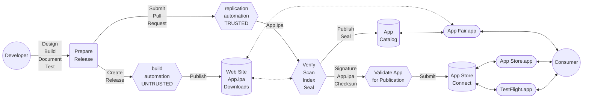

App Fair Process Visuals
========================

## Intro

```mermaid
flowchart LR
    A((Developer)) --  Design\nBuild\nDocument\nTest --> B(Prepare\nRelease)
    B -- Submit\nPull\nRequest --> C{{replication\nautomation\nTRUSTED}}
    B -- Create\nRelease --> D{{build\nautomation\nUNTRUSTED}}
    D -- Publish --> RELDL[(Web Site\nApp.ipa\nDownloads)]
    C -- App.ipa --> VERIFY{{Verify\nScan\nIndex\nSeal}}
    RELDL <-.-> VERIFY
    VERIFY -- Publish\nSeal --> PAC[(App\nCatalog)]
    VERIFY -- Signature\nApp.ipa\nChecksun --> ValidatedApp{{Validate App\nfor Publication}}
    RELDL <-.-> AppFairApp([App Fair.app])
    PAC <--> AppFairApp
    ValidatedApp -- Submit --> PubAppStore[(App Store\nConnect)]
    PubAppStore <--> AppStoreApp([App Store.app])
    PubAppStore <--> TestFlight([TestFlight.app])
    AppFairApp <--> CONSUMER((Consumer))
    AppStoreApp <--> CONSUMER
    TestFlight <--> CONSUMER
```

